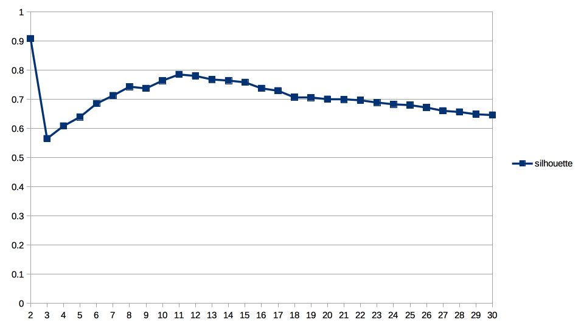
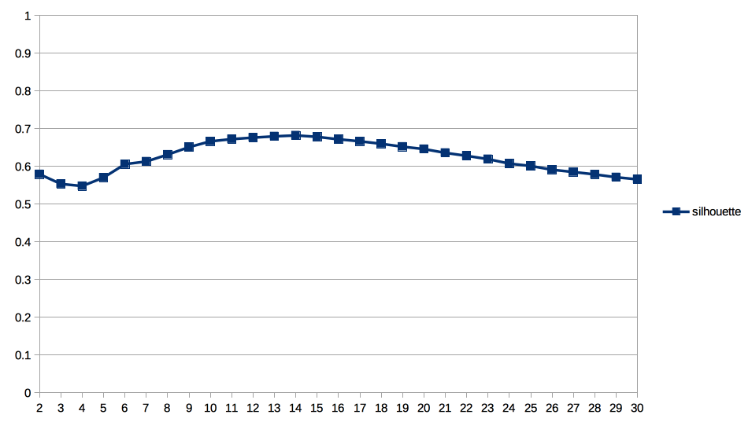
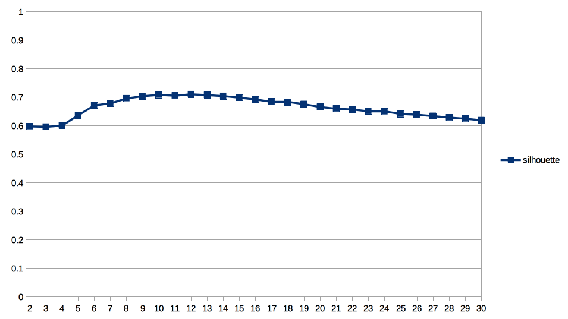
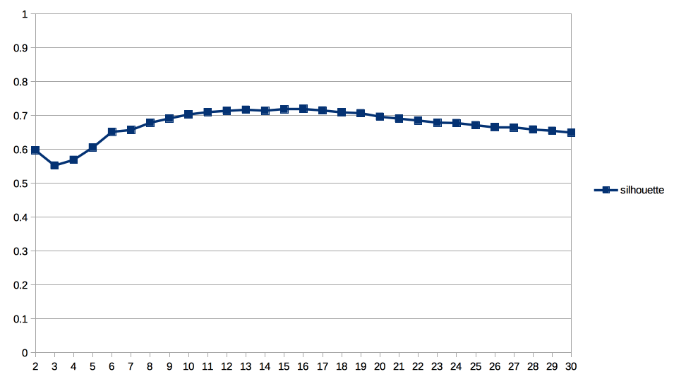

# requirement-clustering-evaluation-2018

<!--ts-->
   * [requirement-clustering-evaluation-2018](#requirement-clustering-evaluation-2018)
      * [Import - external metrics](#import---external-metrics)
      * [Import - internal metrics](#import---internal-metrics)
      * [Verification](#verification)
      * [Top 10 Performers, external metric](#top-10-performers-external-metric)
         * [alpha](#alpha)
         * [beta](#beta)
         * [gamma](#gamma)
         * [delta](#delta)
      * [Top 10 Performers, internal metric](#top-10-performers-internal-metric)
         * [alpha (Human Golden Standard: k=23)](#alpha-human-golden-standard-k23)
         * [beta (Human Golden Standard: k=15)](#beta-human-golden-standard-k15)
         * [gamma (Human Golden Standard: k=19)](#gamma-human-golden-standard-k19)
         * [delta (Human Golden Standard: k=16)](#delta-human-golden-standard-k16)
      * [Correlation between Silhouette and F1](#correlation-between-silhouette-and-f1)
         * [alpha](#alpha-1)
         * [beta](#beta-1)
         * [gamma](#gamma-1)
         * [delta](#delta-1)
      * [Best performances per parameter (external)](#best-performances-per-parameter-external)
         * [alpha](#alpha-2)
         * [beta](#beta-2)
         * [gamma](#gamma-2)
         * [delta](#delta-2)
      * [Best performances per parameter (internal)](#best-performances-per-parameter-internal)
         * [alpha](#alpha-3)
         * [beta](#beta-3)
         * [gamma](#gamma-3)
         * [delta](#delta-3)
      * [k vs. Silhouette, Top 15](#k-vs-silhouette-top-15)
         * [alpha](#alpha-4)
         * [beta](#beta-4)
         * [gamma](#gamma-4)
         * [delta](#delta-4)
      * [Impact of Word2VecAdd, external](#impact-of-word2vecadd-external)
         * [alpha](#alpha-5)
         * [beta](#beta-5)
         * [gamma](#gamma-5)
         * [delta](#delta-5)
      * [Impact of Word2VecAdd, internal](#impact-of-word2vecadd-internal)
         * [alpha](#alpha-6)
         * [beta](#beta-6)
         * [gamma](#gamma-6)
         * [delta](#delta-6)
      * [Impact of Word2VecAverage, external](#impact-of-word2vecaverage-external)
         * [alpha](#alpha-7)
         * [beta](#beta-7)
         * [gamma](#gamma-7)
         * [delta](#delta-7)
      * [Impact of Word2VecAverage, internal](#impact-of-word2vecaverage-internal)
         * [alpha](#alpha-8)
         * [beta](#beta-8)
         * [gamma](#gamma-8)
         * [delta](#delta-8)

<!-- Added by: th, at:  -->

<!--te-->

## Import - external metrics

	sqlite3 external.db << EOF
	
	create table alpha (ClusterAlgorithm, DistanceFunction, UsedFields, Tfidf, StopWords, Lemmatized, Synonyms, GermaNetFunction, Word2VecAdd REAL, Word2VecAverage REAL, F1WeightedAvg REAL, F1WeightedStd REAL, CohesionAvg REAL, CohesionStd REAL, SeperationAvg REAL, SeperationStd REAL, SilhouetteAvg REAL, SilhouetteStd REAL, RuntimeAvg REAL);
	.separator ";"
	.import "alpha.csv" "alpha"
	DELETE from alpha WHERE SeperationAvg = 'SeperationAvg';
	DELETE from alpha WHERE ClusterAlgorithm = '';
	
	create table beta (ClusterAlgorithm, DistanceFunction, UsedFields, Tfidf, StopWords, Lemmatized, Synonyms, GermaNetFunction, Word2VecAdd REAL, Word2VecAverage REAL, F1WeightedAvg REAL, F1WeightedStd REAL, CohesionAvg REAL, CohesionStd REAL, SeperationAvg REAL, SeperationStd REAL, SilhouetteAvg REAL, SilhouetteStd REAL, RuntimeAvg REAL);
	.separator ";"
	.import "beta.csv" "beta"
	DELETE from beta WHERE SeperationAvg = 'SeperationAvg';
	DELETE from beta WHERE ClusterAlgorithm = '';
	
	create table gamma (ClusterAlgorithm, DistanceFunction, UsedFields, Tfidf, StopWords, Lemmatized, Synonyms, GermaNetFunction, Word2VecAdd REAL, Word2VecAverage REAL, F1WeightedAvg REAL, F1WeightedStd REAL, CohesionAvg REAL, CohesionStd REAL, SeperationAvg REAL, SeperationStd REAL, SilhouetteAvg REAL, SilhouetteStd REAL, RuntimeAvg REAL);
	.separator ";"
	.import "gamma.csv" "gamma"
	DELETE from gamma WHERE SeperationAvg = 'SeperationAvg';
	DELETE from gamma WHERE ClusterAlgorithm = '';
	
	create table delta (ClusterAlgorithm, DistanceFunction, UsedFields, Tfidf, StopWords, Lemmatized, Synonyms, GermaNetFunction, Word2VecAdd REAL, Word2VecAverage REAL, F1WeightedAvg REAL, F1WeightedStd REAL, CohesionAvg REAL, CohesionStd REAL, SeperationAvg REAL, SeperationStd REAL, SilhouetteAvg REAL, SilhouetteStd REAL, RuntimeAvg REAL);
	.separator ";"
	.import "delta.csv" "delta"
	DELETE from delta WHERE SeperationAvg = 'SeperationAvg';
	DELETE from delta WHERE ClusterAlgorithm = '';
		
	EOF

## Import - internal metrics

	sqlite3 internal.db << EOF
	
	create table alpha (ClusterAlgorithm, DistanceFunction, Synonyms, GermaNetFunction, Word2VecAdd REAL, Word2VecAverage REAL, k, CohesionAvg REAL, CohesionStd REAL, SeperationAvg REAL, SeperationStd REAL, SilhouetteAvg REAL, SilhouetteStd REAL, RuntimeAvg REAL);
	.separator ";"
	.import "alpha.csv" "alpha"
	DELETE from alpha WHERE SeperationAvg = 'SeperationAvg';
	DELETE from alpha WHERE ClusterAlgorithm = '';
	
	create table beta (ClusterAlgorithm, DistanceFunction, Synonyms, GermaNetFunction, Word2VecAdd REAL, Word2VecAverage REAL, k, CohesionAvg REAL, CohesionStd REAL, SeperationAvg REAL, SeperationStd REAL, SilhouetteAvg REAL, SilhouetteStd REAL, RuntimeAvg REAL);
	.separator ";"
	.import "beta.csv" "beta"
	DELETE from beta WHERE SeperationAvg = 'SeperationAvg';
	DELETE from beta WHERE ClusterAlgorithm = '';
	
	create table gamma (ClusterAlgorithm, DistanceFunction, Synonyms, GermaNetFunction, Word2VecAdd REAL, Word2VecAverage REAL, k, CohesionAvg REAL, CohesionStd REAL, SeperationAvg REAL, SeperationStd REAL, SilhouetteAvg REAL, SilhouetteStd REAL, RuntimeAvg REAL);
	.separator ";"
	.import "gamma.csv" "gamma"
	DELETE from gamma WHERE SeperationAvg = 'SeperationAvg';
	DELETE from gamma WHERE ClusterAlgorithm = '';
	
	create table delta (ClusterAlgorithm, DistanceFunction, Synonyms, GermaNetFunction, Word2VecAdd REAL, Word2VecAverage REAL, k, CohesionAvg REAL, CohesionStd REAL, SeperationAvg REAL, SeperationStd REAL, SilhouetteAvg REAL, SilhouetteStd REAL, RuntimeAvg REAL);
	.separator ";"
	.import "delta.csv" "delta"
	DELETE from delta WHERE SeperationAvg = 'SeperationAvg';
	DELETE from delta WHERE ClusterAlgorithm = '';
			
	EOF

## Verification 

	select "alpha", count(*) from alpha
	UNION ALL 
	select "beta", count(*) from beta
	UNION ALL 
	select "delta", count(*) from delta
	UNION ALL 
	select "gamma", count(*) from gamma

dataset|count
---|---
"alpha"|"2204"
"beta"|"2204"
"delta"|"2204"
"gamma"|"2204"

## Top 10 Performers, external metric
	select clusteralgorithm,distancefunction,usedfields,tfidf,stopwords,lemmatized,synonyms,germanetfunction,Word2VecAdd,Word2VecAverage,F1WeightedAvg from alpha order by F1WeightedAvg desc
	limit 10
	
### alpha

clusteralgorithm|distancefunction|usedfields|tfidf|stopwords|lemmatized|synonyms|germanetfunction|Word2VecAdd|Word2VecAverage|F1WeightedAvg
---|---|---|---|---|---|---|---|---|---|---|
FuzzyCMeans2320|CosineDistance|7|true|true|true|false|false|false|false|0.3443
FuzzyCMeans2320|CosineDistance|7|true|true|true|true|false|false|false|0.3417
KMeans2320|CosineDistance|7|true|true|true|false|false|false|true|0.3209
FuzzyCMeans2320|CosineDistance|7|true|true|true|false|false|true|false|0.3205
KMeans2320|CosineDistance|7|true|true|true|false|false|true|false|0.3165
FuzzyCMeans2320|CosineDistance|7|true|true|true|false|false|false|true|0.3134
FuzzyCMeans2320|CosineDistance|7|true|true|true|true|false|true|false|0.3002
KMeans2320|CosineDistance|7|true|true|true|true|false|false|true|0.299
KMeans2320|EuclideanDistance|7|true|true|true|false|false|false|true|0.299
KMeans2320|CosineDistance|7|true|true|true|false|false|false|false|0.2987

### beta

clusteralgorithm|distancefunction|usedfields|tfidf|stopwords|lemmatized|synonyms|germanetfunction|Word2VecAdd|Word2VecAverage|F1WeightedAvg
---|---|---|---|---|---|---|---|---|---|---|
ClusterART|Not needed|7|true|true|true|true|true|false|false|0.7506
Neural Gas|CosineDistance|7|true|true|true|true|true|true|false|0.5297
Neural Gas|CosineDistance|7|true|true|true|true|true|false|false|0.5285
Neural Gas|CosineDistance|7|true|true|true|true|true|false|true|0.5284
ClusterART|Not needed|7|true|true|true|false|true|false|false|0.5024
Neural Gas|EuclideanDistance|7|true|true|true|true|true|false|true|0.4872
FuzzyCMeans1520|EuclideanDistance|7|true|true|true|false|false|true|false|0.4618
Neural Gas|EuclideanDistance|7|true|true|true|true|false|false|true|0.4617
KMeans1520|WordEmbDistance|7|true|true|true|true|false|false|false|0.459
KMeans1520|WordEmbDistance|7|true|true|true|true|false|false|true|0.459

### gamma
clusteralgorithm|distancefunction|usedfields|tfidf|stopwords|lemmatized|synonyms|germanetfunction|Word2VecAdd|Word2VecAverage|F1WeightedAvg
---|---|---|---|---|---|---|---|---|---|---|
KMeans1720|CosineDistance|7|true|true|true|false|false|false|false|0.5184
KMeans1720|CosineDistance|7|true|true|true|true|false|false|false|0.5044
ClusterART|Not needed|7|true|true|true|true|false|false|false|0.4662
KMeans1720|EuclideanDistance|7|true|true|true|false|false|false|false|0.463
FuzzyCMeans1720|CosineDistance|7|true|true|true|false|false|false|false|0.4353
FuzzyCMeans1720|EuclideanDistance|7|true|true|true|false|false|false|false|0.4352
KMeans1720|EuclideanDistance|7|true|true|true|true|false|false|false|0.4335
FuzzyCMeans1720|CosineDistance|7|true|true|true|true|false|false|false|0.417
FuzzyCMeans1720|EuclideanDistance|7|true|true|true|true|false|false|false|0.4111
KMeans1720|EuclideanDistance|7|true|true|true|false|false|false|true|0.4097

### delta
clusteralgorithm|distancefunction|usedfields|tfidf|stopwords|lemmatized|synonyms|germanetfunction|Word2VecAdd|Word2VecAverage|F1WeightedAvg
---|---|---|---|---|---|---|---|---|---|---|
ClusterART|Not needed|7|true|true|true|true|false|false|false|0.5622
ClusterART|Not needed|7|true|true|true|false|false|false|false|0.5584
Neural Gas|CosineDistance|7|true|true|true|false|false|false|false|0.5102
Neural Gas|CosineDistance|7|true|true|true|true|false|false|false|0.5093
Neural Gas|EuclideanDistance|7|true|true|true|false|false|false|false|0.5082
Neural Gas|EuclideanDistance|7|true|true|true|true|false|false|false|0.5017
KMeans1620|CosineDistance|7|true|true|true|false|false|false|false|0.4604
Neural Gas|EuclideanDistance|7|true|true|true|true|false|false|true|0.4552
Neural Gas|EuclideanDistance|7|true|true|true|false|false|false|true|0.454
KMeans1620|CosineDistance|7|true|true|true|true|false|false|false|0.45

## Top 10 Performers, internal metric

	select k, clusteralgorithm, distancefunction,word2vecadd,word2vecaverage,SilhouetteAvg from alpha order by silhouetteavg desc
	limit 10

### alpha (Human Golden Standard: k=23)
k|clusteralgorithm|distancefunction|word2vecadd|word2vecaverage|SilhouetteAvg
---|---|---|---|---|---|
2|KMeans220|EuclideanDistance|true|false|0.9084
2|KMeans220|EuclideanDistance|true|false|0.9082
2|KMeans220|EuclideanDistance|false|true|0.8006
11|FuzzyCMeans1120|EuclideanDistance|true|false|0.7854
12|FuzzyCMeans1220|EuclideanDistance|true|false|0.7803
13|FuzzyCMeans1320|EuclideanDistance|true|false|0.7681
14|FuzzyCMeans1420|EuclideanDistance|true|false|0.7644
10|FuzzyCMeans1020|EuclideanDistance|true|false|0.7643
15|FuzzyCMeans1520|EuclideanDistance|true|false|0.7584
8|FuzzyCMeans820|EuclideanDistance|true|false|0.7434

### beta (Human Golden Standard: k=15)
k|clusteralgorithm|distancefunction|word2vecadd|word2vecaverage|SilhouetteAvg
---|---|---|---|---|---|
14|KMeans1420|EuclideanDistance|true|false|0.6819
13|KMeans1320|EuclideanDistance|true|false|0.6794
15|KMeans1520|EuclideanDistance|true|false|0.6781
12|KMeans1220|EuclideanDistance|true|false|0.6761
11|KMeans1120|EuclideanDistance|true|false|0.6721
16|KMeans1620|EuclideanDistance|true|false|0.6716
17|KMeans1720|EuclideanDistance|true|false|0.6663
10|KMeans1020|EuclideanDistance|true|false|0.6662
18|KMeans1820|EuclideanDistance|true|false|0.6598
15|FuzzyCMeans1520|EuclideanDistance|true|false|0.6559

### gamma (Human Golden Standard: k=19)
k|clusteralgorithm|distancefunction|word2vecadd|word2vecaverage|SilhouetteAvg
---|---|---|---|---|---|
12|KMeans1220|EuclideanDistance|true|false|0.7102
10|KMeans1020|EuclideanDistance|true|false|0.7081
13|KMeans1320|EuclideanDistance|true|false|0.7073
11|KMeans1120|EuclideanDistance|true|false|0.7053
14|KMeans1420|EuclideanDistance|true|false|0.7039
9|KMeans920|EuclideanDistance|true|false|0.7036
15|KMeans1520|EuclideanDistance|true|false|0.6983
8|KMeans820|EuclideanDistance|true|false|0.6957
16|KMeans1620|EuclideanDistance|true|false|0.6919
11|KMeans1120|EuclideanDistance|true|false|0.6881

### delta (Human Golden Standard: k=16)
k|clusteralgorithm|distancefunction|word2vecadd|word2vecaverage|SilhouetteAvg
---|---|---|---|---|---|
16|FuzzyCMeans1620|EuclideanDistance|true|false|0.7195
15|FuzzyCMeans1520|EuclideanDistance|true|false|0.7181
13|FuzzyCMeans1320|EuclideanDistance|true|false|0.7169
17|FuzzyCMeans1720|EuclideanDistance|true|false|0.7149
14|FuzzyCMeans1420|EuclideanDistance|true|false|0.7142
14|KMeans1420|EuclideanDistance|true|false|0.714
12|FuzzyCMeans1220|EuclideanDistance|true|false|0.7137
13|KMeans1320|EuclideanDistance|true|false|0.7117
12|KMeans1220|EuclideanDistance|true|false|0.7104
16|KMeans1620|EuclideanDistance|true|false|0.7103

## Correlation between Silhouette and F1

	select SilhouetteAvg,F1WeightedAvg from alpha
	where distancefunction <> "WordEmbDistance" -- Not supported distance function

### alpha

	CORREL(SilhouetteAvg, F1WeightedAvg) = -0.002879579897854

### beta

	CORREL(SilhouetteAvg, F1WeightedAvg) = -0.321574158661689

### gamma

	CORREL(SilhouetteAvg, F1WeightedAvg) = -0.211575766205108

### delta
	CORREL(SilhouetteAvg, F1WeightedAvg) = -0.195570970269602

## Best performances per parameter (external)

	select ClusterAlgorithm, DistanceFunction, Synonyms, Tfidf, Synonyms, GermaNetFunction, Word2VecAdd, Word2VecAverage, SilhouetteAvg, max(F1WeightedAvg) BestF1 from alpha
	group by ClusterAlgorithm
	order by BestF1 desc

### alpha
ClusterAlgorithm|DistanceFunction|Synonyms|Tfidf|Synonyms|GermaNetFunction|Word2VecAdd|Word2VecAverage|SilhouetteAvg|BestF1
---|---|---|---|---|---|---|---|---|---|
FuzzyCMeans2320|CosineDistance|false|true|false|false|false|false|0.0847|0.3443
KMeans2320|CosineDistance|false|true|false|false|false|true|0.0374|0.3209
Neural Gas|EuclideanDistance|false|true|false|true|false|true|0.0893|0.2475
ClusterART|Not needed|false|true|false|false|false|false|0.1943|0.2383

### beta
ClusterAlgorithm|DistanceFunction|Synonyms|Tfidf|Synonyms|GermaNetFunction|Word2VecAdd|Word2VecAverage|SilhouetteAvg|BestF1
---|---|---|---|---|---|---|---|---|---|
ClusterART|Not needed|true|true|true|true|false|false|0.0189|0.7506
Neural Gas|CosineDistance|true|true|true|true|true|false|-0.0464|0.5297
FuzzyCMeans1520|EuclideanDistance|false|true|false|false|true|false|0.022|0.4618
KMeans1520|WordEmbDistance|true|true|true|false|false|false|-1.0|0.459

### gamma
ClusterAlgorithm|DistanceFunction|Synonyms|Tfidf|Synonyms|GermaNetFunction|Word2VecAdd|Word2VecAverage|SilhouetteAvg|BestF1
---|---|---|---|---|---|---|---|---|---|
KMeans1720|CosineDistance|false|true|false|false|false|false|0.1451|0.5184
ClusterART|Not needed|true|true|true|false|false|false|0.2436|0.4662
FuzzyCMeans1720|CosineDistance|false|true|false|false|false|false|0.1041|0.4353
Neural Gas|CosineDistance|true|true|true|false|false|true|0.0701|0.4083

### delta
ClusterAlgorithm|DistanceFunction|Synonyms|Tfidf|Synonyms|GermaNetFunction|Word2VecAdd|Word2VecAverage|SilhouetteAvg|BestF1
---|---|---|---|---|---|---|---|---|---|
ClusterART|Not needed|true|true|true|false|false|false|0.2014|0.5622
Neural Gas|CosineDistance|false|true|false|false|false|false|0.0636|0.5102
KMeans1620|CosineDistance|false|true|false|false|false|false|0.1435|0.4604
FuzzyCMeans1620|EuclideanDistance|false|true|false|false|false|true|0.0227|0.4394

## Best performances per parameter (internal)

	select ClusterAlgorithm, k, DistanceFunction, Synonyms, Synonyms, GermaNetFunction, Word2VecAdd, Word2VecAverage, max(SilhouetteAvg) from alpha
	group by ClusterAlgorithm
	order by SilhouetteAvg desc
	
	
### alpha

ClusterAlgorithm|k|DistanceFunction|Synonyms|Synonyms|GermaNetFunction|Word2VecAdd|Word2VecAverage|Best SilhouetteAvg|
---|---|---|---|---|---|---|---|---| 
KMeans220|2|EuclideanDistance|true|true|false|true|false|0.9084
FuzzyCMeans1120|11|EuclideanDistance|true|true|true|true|false|0.7854
FuzzyCMeans1220|12|EuclideanDistance|true|true|true|true|false|0.7803
FuzzyCMeans1320|13|EuclideanDistance|true|true|true|true|false|0.7681
FuzzyCMeans1420|14|EuclideanDistance|true|true|true|true|false|0.7644
FuzzyCMeans1020|10|EuclideanDistance|true|true|true|true|false|0.7643
FuzzyCMeans1520|15|EuclideanDistance|true|true|true|true|false|0.7584
FuzzyCMeans820|8|EuclideanDistance|true|true|true|true|false|0.7434
FuzzyCMeans1620|16|EuclideanDistance|true|true|true|true|false|0.7376
FuzzyCMeans920|9|EuclideanDistance|true|true|true|true|false|0.7375
KMeans1020|10|EuclideanDistance|true|true|true|true|false|0.7351
KMeans920|9|EuclideanDistance|true|true|true|true|false|0.7344
KMeans1120|11|EuclideanDistance|true|true|true|true|false|0.7332
FuzzyCMeans1720|17|EuclideanDistance|true|true|true|true|false|0.7295
KMeans1220|12|EuclideanDistance|true|true|true|true|false|0.7289
KMeans1320|13|EuclideanDistance|false|false|true|true|false|0.7282
KMeans820|8|EuclideanDistance|true|true|true|true|false|0.726
KMeans1420|14|EuclideanDistance|false|false|true|true|false|0.7251
KMeans1520|15|EuclideanDistance|false|false|true|true|false|0.7196
KMeans1620|16|EuclideanDistance|false|false|true|true|false|0.7166
KMeans1720|17|EuclideanDistance|false|false|true|true|false|0.715
KMeans720|7|EuclideanDistance|true|true|true|true|false|0.713
FuzzyCMeans720|7|EuclideanDistance|true|true|true|true|false|0.7085
KMeans1820|18|EuclideanDistance|false|false|true|true|false|0.7074
FuzzyCMeans1820|18|EuclideanDistance|true|true|true|true|false|0.7062
FuzzyCMeans1920|19|EuclideanDistance|true|true|true|true|false|0.7059
KMeans1920|19|EuclideanDistance|false|false|true|true|false|0.7047
KMeans2020|20|EuclideanDistance|false|false|true|true|false|0.7005
KMeans2120|21|EuclideanDistance|false|false|true|true|false|0.6994
FuzzyCMeans2020|20|EuclideanDistance|true|true|true|true|false|0.6975
KMeans2220|22|EuclideanDistance|false|false|true|true|false|0.6967
KMeans2320|23|EuclideanDistance|false|false|true|true|false|0.689
KMeans620|6|EuclideanDistance|true|true|true|true|false|0.6854
KMeans2420|24|EuclideanDistance|false|false|true|true|false|0.683
KMeans2520|25|EuclideanDistance|false|false|true|true|false|0.6801
FuzzyCMeans2120|21|EuclideanDistance|true|true|true|true|false|0.6797
FuzzyCMeans2220|22|EuclideanDistance|true|true|true|true|false|0.6777
FuzzyCMeans620|6|EuclideanDistance|true|true|true|true|false|0.6721
KMeans2620|26|EuclideanDistance|false|false|true|true|false|0.6719
FuzzyCMeans2320|23|EuclideanDistance|true|true|true|true|false|0.6656
KMeans2720|27|EuclideanDistance|false|false|true|true|false|0.6606
KMeans2820|28|EuclideanDistance|false|false|true|true|false|0.6566
FuzzyCMeans2420|24|EuclideanDistance|true|true|true|true|false|0.6549
KMeans2920|29|EuclideanDistance|false|false|true|true|false|0.6487
KMeans3020|30|EuclideanDistance|false|false|true|true|false|0.6461
FuzzyCMeans2520|25|EuclideanDistance|true|true|true|true|false|0.6443
FuzzyCMeans2620|26|EuclideanDistance|true|true|true|true|false|0.6428
KMeans520|5|EuclideanDistance|true|true|true|true|false|0.6395
FuzzyCMeans2720|27|EuclideanDistance|true|true|true|true|false|0.6279
FuzzyCMeans2820|28|EuclideanDistance|true|true|true|true|false|0.6222
FuzzyCMeans520|5|EuclideanDistance|true|true|true|true|false|0.6151
FuzzyCMeans2920|29|EuclideanDistance|true|true|true|true|false|0.6109
KMeans420|4|EuclideanDistance|true|true|true|false|true|0.6086
FuzzyCMeans3020|30|EuclideanDistance|true|true|true|true|false|0.5966
FuzzyCMeans220|2|EuclideanDistance|false|false|true|false|true|0.5666
KMeans320|3|EuclideanDistance|true|true|true|true|false|0.5651
FuzzyCMeans420|4|EuclideanDistance|false|false|true|false|true|0.5507
Neural Gas|2|EuclideanDistance|true|true|true|false|true|0.545
FuzzyCMeans320|3|EuclideanDistance|true|true|true|false|true|0.5406
ClusterART|27|Not needed|false|false|false|false|false|0.2134

### beta

ClusterAlgorithm|k|DistanceFunction|Synonyms|Synonyms|GermaNetFunction|Word2VecAdd|Word2VecAverage|Best SilhouetteAvg|
---|---|---|---|---|---|---|---|---| 
KMeans1420|14|EuclideanDistance|false|false|true|true|false|0.6819
KMeans1320|13|EuclideanDistance|false|false|true|true|false|0.6794
KMeans1520|15|EuclideanDistance|false|false|true|true|false|0.6781
KMeans1220|12|EuclideanDistance|false|false|true|true|false|0.6761
KMeans1120|11|EuclideanDistance|false|false|true|true|false|0.6721
KMeans1620|16|EuclideanDistance|false|false|true|true|false|0.6716
KMeans1720|17|EuclideanDistance|false|false|true|true|false|0.6663
KMeans1020|10|EuclideanDistance|false|false|true|true|false|0.6662
KMeans1820|18|EuclideanDistance|false|false|true|true|false|0.6598
FuzzyCMeans1520|15|EuclideanDistance|true|true|true|true|false|0.6559
KMeans1920|19|EuclideanDistance|false|false|true|true|false|0.652
FuzzyCMeans1420|14|EuclideanDistance|true|true|true|true|false|0.6509
KMeans920|9|EuclideanDistance|false|false|true|true|false|0.6509
FuzzyCMeans1620|16|EuclideanDistance|true|true|true|true|false|0.6482
KMeans2020|20|EuclideanDistance|false|false|true|true|false|0.6458
FuzzyCMeans1320|13|EuclideanDistance|true|true|true|true|false|0.6435
FuzzyCMeans1720|17|EuclideanDistance|true|true|true|true|false|0.6392
FuzzyCMeans1220|12|EuclideanDistance|true|true|true|true|false|0.6362
KMeans2120|21|EuclideanDistance|false|false|true|true|false|0.6357
KMeans820|8|EuclideanDistance|true|true|true|true|false|0.6311
FuzzyCMeans1820|18|EuclideanDistance|true|true|true|true|false|0.6297
KMeans2220|22|EuclideanDistance|false|false|true|true|false|0.6278
KMeans2320|23|EuclideanDistance|false|false|true|true|false|0.6191
FuzzyCMeans1920|19|EuclideanDistance|true|true|true|true|false|0.615
FuzzyCMeans920|9|EuclideanDistance|true|true|true|true|false|0.6149
FuzzyCMeans720|7|EuclideanDistance|true|true|true|true|false|0.6127
KMeans720|7|EuclideanDistance|true|true|true|true|false|0.6117
FuzzyCMeans2020|20|EuclideanDistance|true|true|true|true|false|0.6075
KMeans2420|24|EuclideanDistance|false|false|true|true|false|0.6071
FuzzyCMeans1020|10|EuclideanDistance|true|true|true|true|false|0.6063
FuzzyCMeans1120|11|EuclideanDistance|false|false|true|true|false|0.6057
FuzzyCMeans620|6|EuclideanDistance|true|true|true|true|false|0.6057
KMeans2520|25|EuclideanDistance|false|false|true|true|false|0.6009
FuzzyCMeans820|8|EuclideanDistance|true|true|true|true|false|0.6004
FuzzyCMeans2120|21|EuclideanDistance|true|true|true|true|false|0.5949
KMeans2620|26|EuclideanDistance|false|false|true|true|false|0.5908
KMeans620|6|EuclideanDistance|true|true|true|true|false|0.5868
KMeans2720|27|EuclideanDistance|false|false|true|true|false|0.5849
FuzzyCMeans2220|22|EuclideanDistance|true|true|true|true|false|0.5811
FuzzyCMeans220|2|EuclideanDistance|false|false|true|false|true|0.579
KMeans2820|28|EuclideanDistance|false|false|true|true|false|0.5785
FuzzyCMeans2320|23|EuclideanDistance|true|true|true|true|false|0.5763
KMeans2920|29|EuclideanDistance|false|false|true|true|false|0.571
KMeans220|2|EuclideanDistance|false|false|true|false|true|0.5709
KMeans520|5|EuclideanDistance|false|false|true|false|true|0.5702
KMeans3020|30|EuclideanDistance|false|false|true|true|false|0.5654
FuzzyCMeans2420|24|EuclideanDistance|true|true|true|true|false|0.5599
Neural Gas|2|EuclideanDistance|false|false|true|false|true|0.5588
FuzzyCMeans2520|25|EuclideanDistance|true|true|true|true|false|0.5537
KMeans320|3|EuclideanDistance|false|false|true|false|true|0.5533
FuzzyCMeans2620|26|EuclideanDistance|true|true|true|true|false|0.5492
KMeans420|4|EuclideanDistance|true|true|true|true|false|0.5477
FuzzyCMeans320|3|EuclideanDistance|false|false|true|false|true|0.5346
FuzzyCMeans520|5|EuclideanDistance|false|false|true|false|true|0.5323
FuzzyCMeans2720|27|EuclideanDistance|true|true|true|true|false|0.5319
FuzzyCMeans420|4|EuclideanDistance|false|false|true|false|true|0.5243
FuzzyCMeans2820|28|EuclideanDistance|true|true|true|true|false|0.5177
FuzzyCMeans2920|29|EuclideanDistance|true|true|true|true|false|0.5044
FuzzyCMeans3020|30|EuclideanDistance|true|true|true|true|false|0.5016
ClusterART|2|Not needed|false|false|false|false|false|0.2176

### gamma

ClusterAlgorithm|k|DistanceFunction|Synonyms|Synonyms|GermaNetFunction|Word2VecAdd|Word2VecAverage|Best SilhouetteAvg|
---|---|---|---|---|---|---|---|---| 
KMeans1220|12|EuclideanDistance|true|true|true|true|false|0.7102
KMeans1020|10|EuclideanDistance|true|true|true|true|false|0.7081
KMeans1320|13|EuclideanDistance|true|true|true|true|false|0.7073
KMeans1120|11|EuclideanDistance|true|true|true|true|false|0.7053
KMeans1420|14|EuclideanDistance|true|true|true|true|false|0.7039
KMeans920|9|EuclideanDistance|true|true|true|true|false|0.7036
KMeans1520|15|EuclideanDistance|true|true|true|true|false|0.6983
KMeans820|8|EuclideanDistance|true|true|true|true|false|0.6957
KMeans1620|16|EuclideanDistance|true|true|true|true|false|0.6919
KMeans1720|17|EuclideanDistance|true|true|true|true|false|0.6843
KMeans1820|18|EuclideanDistance|true|true|true|true|false|0.6827
FuzzyCMeans1720|17|EuclideanDistance|true|true|true|true|false|0.6799
FuzzyCMeans1620|16|EuclideanDistance|true|true|true|true|false|0.6795
KMeans720|7|EuclideanDistance|true|true|true|true|false|0.6784
KMeans1920|19|EuclideanDistance|true|true|true|true|false|0.6755
FuzzyCMeans620|6|EuclideanDistance|true|true|true|true|false|0.6714
FuzzyCMeans1520|15|EuclideanDistance|true|true|true|true|false|0.6707
FuzzyCMeans1920|19|EuclideanDistance|true|true|true|true|false|0.667
KMeans2020|20|EuclideanDistance|true|true|true|true|false|0.6655
FuzzyCMeans1820|18|EuclideanDistance|true|true|true|true|false|0.6639
FuzzyCMeans1320|13|EuclideanDistance|true|true|true|true|false|0.66
KMeans2120|21|EuclideanDistance|true|true|true|true|false|0.6597
FuzzyCMeans1420|14|EuclideanDistance|true|true|true|true|false|0.6593
KMeans620|6|EuclideanDistance|true|true|true|true|false|0.6584
KMeans2220|22|EuclideanDistance|true|true|true|true|false|0.6569
FuzzyCMeans2020|20|EuclideanDistance|true|true|true|true|false|0.6515
KMeans2320|23|EuclideanDistance|true|true|true|true|false|0.6512
KMeans2420|24|EuclideanDistance|true|true|true|true|false|0.6496
FuzzyCMeans1220|12|EuclideanDistance|true|true|true|true|false|0.6468
FuzzyCMeans820|8|EuclideanDistance|false|false|true|true|false|0.6453
KMeans2520|25|EuclideanDistance|true|true|true|true|false|0.6411
FuzzyCMeans1020|10|EuclideanDistance|true|true|true|true|false|0.6394
FuzzyCMeans2120|21|EuclideanDistance|false|false|true|true|false|0.6392
KMeans2620|26|EuclideanDistance|true|true|true|true|false|0.6385
KMeans520|5|EuclideanDistance|true|true|true|true|false|0.6366
KMeans2720|27|EuclideanDistance|true|true|true|true|false|0.6338
FuzzyCMeans2220|22|EuclideanDistance|false|false|true|true|false|0.6312
FuzzyCMeans2320|23|EuclideanDistance|false|false|true|true|false|0.6312
KMeans2820|28|EuclideanDistance|true|true|true|true|false|0.6285
FuzzyCMeans1120|11|EuclideanDistance|true|true|true|true|false|0.6259
FuzzyCMeans520|5|EuclideanDistance|true|true|true|false|true|0.6258
FuzzyCMeans2420|24|EuclideanDistance|false|false|true|true|false|0.6253
KMeans2920|29|EuclideanDistance|true|true|true|true|false|0.6246
FuzzyCMeans920|9|EuclideanDistance|true|true|true|true|false|0.6243
FuzzyCMeans2520|25|EuclideanDistance|false|false|true|true|false|0.6213
FuzzyCMeans720|7|EuclideanDistance|true|true|true|true|false|0.6202
KMeans3020|30|EuclideanDistance|true|true|true|true|false|0.6189
FuzzyCMeans2620|26|EuclideanDistance|false|false|true|true|false|0.6027
KMeans420|4|EuclideanDistance|false|false|true|false|true|0.6004
KMeans220|2|EuclideanDistance|false|false|true|true|false|0.5975
KMeans320|3|EuclideanDistance|true|true|true|false|true|0.596
FuzzyCMeans220|2|EuclideanDistance|false|false|true|true|false|0.5943
FuzzyCMeans2720|27|EuclideanDistance|false|false|true|true|false|0.594
FuzzyCMeans2820|28|EuclideanDistance|false|false|true|true|false|0.5865
FuzzyCMeans420|4|EuclideanDistance|true|true|true|false|true|0.5813
Neural Gas|2|EuclideanDistance|true|true|true|true|false|0.5772
FuzzyCMeans2920|29|EuclideanDistance|false|false|true|true|false|0.5711
FuzzyCMeans320|3|EuclideanDistance|true|true|true|true|false|0.5697
FuzzyCMeans3020|30|EuclideanDistance|false|false|true|true|false|0.5594
ClusterART|13|Not needed|false|false|false|false|false|0.3186

### delta

ClusterAlgorithm|k|DistanceFunction|Synonyms|Synonyms|GermaNetFunction|Word2VecAdd|Word2VecAverage|Best SilhouetteAvg|
---|---|---|---|---|---|---|---|---| 
FuzzyCMeans1620|16|EuclideanDistance|true|true|true|true|false|0.7195
FuzzyCMeans1520|15|EuclideanDistance|true|true|true|true|false|0.7181
FuzzyCMeans1320|13|EuclideanDistance|true|true|true|true|false|0.7169
FuzzyCMeans1720|17|EuclideanDistance|true|true|true|true|false|0.7149
FuzzyCMeans1420|14|EuclideanDistance|true|true|true|true|false|0.7142
KMeans1420|14|EuclideanDistance|true|true|true|true|false|0.714
FuzzyCMeans1220|12|EuclideanDistance|true|true|true|true|false|0.7137
KMeans1320|13|EuclideanDistance|true|true|true|true|false|0.7117
KMeans1220|12|EuclideanDistance|true|true|true|true|false|0.7104
KMeans1620|16|EuclideanDistance|true|true|true|true|false|0.7103
KMeans1120|11|EuclideanDistance|true|true|true|true|false|0.7099
KMeans1520|15|EuclideanDistance|true|true|true|true|false|0.7094
FuzzyCMeans1820|18|EuclideanDistance|true|true|true|true|false|0.7093
FuzzyCMeans1920|19|EuclideanDistance|true|true|true|true|false|0.7067
KMeans1720|17|EuclideanDistance|true|true|true|true|false|0.7041
KMeans1020|10|EuclideanDistance|true|true|true|true|false|0.7031
KMeans1820|18|EuclideanDistance|true|true|true|true|false|0.7012
KMeans1920|19|EuclideanDistance|true|true|true|true|false|0.6988
KMeans2020|20|EuclideanDistance|true|true|true|true|false|0.6964
FuzzyCMeans2020|20|EuclideanDistance|true|true|true|true|false|0.6914
KMeans920|9|EuclideanDistance|true|true|true|true|false|0.6913
KMeans2120|21|EuclideanDistance|true|true|true|true|false|0.6906
FuzzyCMeans2120|21|EuclideanDistance|true|true|true|true|false|0.6866
KMeans2220|22|EuclideanDistance|true|true|true|true|false|0.6851
KMeans2320|23|EuclideanDistance|true|true|true|true|false|0.6789
KMeans820|8|EuclideanDistance|true|true|true|true|false|0.6786
FuzzyCMeans1120|11|EuclideanDistance|false|false|true|true|false|0.6782
KMeans2420|24|EuclideanDistance|true|true|true|true|false|0.6777
FuzzyCMeans2220|22|EuclideanDistance|true|true|true|true|false|0.6748
FuzzyCMeans1020|10|EuclideanDistance|false|false|true|true|false|0.6744
KMeans2520|25|EuclideanDistance|true|true|true|true|false|0.6713
KMeans2620|26|EuclideanDistance|true|true|true|true|false|0.6657
FuzzyCMeans2320|23|EuclideanDistance|true|true|true|true|false|0.6652
KMeans2720|27|EuclideanDistance|true|true|true|true|false|0.6641
KMeans2820|28|EuclideanDistance|true|true|true|true|false|0.6586
FuzzyCMeans920|9|EuclideanDistance|false|false|true|true|false|0.6577
KMeans720|7|EuclideanDistance|false|false|true|true|false|0.6571
KMeans2920|29|EuclideanDistance|true|true|true|true|false|0.6548
FuzzyCMeans620|6|EuclideanDistance|false|false|true|false|true|0.6518
FuzzyCMeans2420|24|EuclideanDistance|false|false|true|true|false|0.6507
KMeans3020|30|EuclideanDistance|true|true|true|true|false|0.6494
FuzzyCMeans820|8|EuclideanDistance|true|true|true|true|false|0.6493
FuzzyCMeans2520|25|EuclideanDistance|false|false|true|true|false|0.6477
FuzzyCMeans2620|26|EuclideanDistance|false|false|true|true|false|0.6462
FuzzyCMeans2720|27|EuclideanDistance|false|false|true|true|false|0.6413
FuzzyCMeans720|7|EuclideanDistance|false|false|true|true|false|0.6395
KMeans620|6|EuclideanDistance|true|true|true|true|false|0.6378
FuzzyCMeans2820|28|EuclideanDistance|false|false|true|true|false|0.6359
FuzzyCMeans2920|29|EuclideanDistance|false|false|true|true|false|0.6153
KMeans520|5|EuclideanDistance|false|false|true|false|true|0.6056
FuzzyCMeans3020|30|EuclideanDistance|false|false|true|true|false|0.6017
KMeans220|2|EuclideanDistance|true|true|true|true|false|0.5973
FuzzyCMeans220|2|EuclideanDistance|true|true|true|false|true|0.5849
Neural Gas|2|EuclideanDistance|false|false|true|false|true|0.5828
KMeans420|4|EuclideanDistance|true|true|true|true|false|0.569
KMeans320|3|EuclideanDistance|false|false|true|false|true|0.5522
FuzzyCMeans420|4|EuclideanDistance|false|false|true|false|true|0.5503
FuzzyCMeans320|3|EuclideanDistance|false|false|true|false|true|0.5451
FuzzyCMeans520|5|EuclideanDistance|false|false|true|false|true|0.5213
ClusterART|10|Not needed|false|false|true|false|false|0.4338

## k vs. Silhouette, sorted by k

	select k, max(SilhouetteAvg) from gamma group by k order by SilhouetteAvg desc

### alpha

### beta

### gamma

### delta

## k vs. Silhouette, Top 15

		select k, max(SilhouetteAvg) from delta group by k order by SilhouetteAvg desc
	limit 15

### alpha

### beta

### gamma

### delta

## Impact of Word2VecAdd, external

	select *, round(("F1 with Word2VecAdd"-"F1 without Word2VecAdd")/"F1 with Word2VecAdd"*100, 2) as "Difference in %" from (
	select a.ClusterAlgorithm as "Cluster Algorithm", a.DistanceFunction as "Distance Function", max(a.F1WeightedAvg) as "F1 with Word2VecAdd", max(b.F1WeightedAvg) as "F1 without Word2VecAdd" from alpha a
	left outer join alpha b on (b.ClusterAlgorithm = a.ClusterAlgorithm and a.DistanceFunction = b.DistanceFunction)
	where a.Word2VecAdd = "true" and b.Word2VecAdd = "false"
	group by a.ClusterAlgorithm, a.DistanceFunction
	order by a.F1WeightedAvg desc
	)
	
### alpha
Cluster Algorithm|Distance Function|F1 with Word2VecAdd|F1 without Word2VecAdd|Difference in %
---|---|---|---|---|
FuzzyCMeans2320|CosineDistance|0.3205|0.3443|-7.43
KMeans2320|CosineDistance|0.3165|0.3209|-1.39
KMeans2320|WordEmbDistance|0.2465|0.2465|0.0
KMeans2320|EuclideanDistance|0.2404|0.299|-24.38
Neural Gas|CosineDistance|0.236|0.2314|1.95
Neural Gas|EuclideanDistance|0.2347|0.2475|-5.45
FuzzyCMeans2320|EuclideanDistance|0.214|0.2619|-22.38

### beta
Cluster Algorithm|Distance Function|F1 with Word2VecAdd|F1 without Word2VecAdd|Difference in %
---|---|---|---|---|
FuzzyCMeans1520|EuclideanDistance|0.4618|0.4512|2.3
KMeans1520|WordEmbDistance|0.4529|0.459|-1.35
Neural Gas|EuclideanDistance|0.4509|0.4872|-8.05
Neural Gas|CosineDistance|0.5297|0.5285|0.23
KMeans1520|EuclideanDistance|0.294|0.4282|-45.65
KMeans1520|CosineDistance|0.3252|0.4161|-27.95
FuzzyCMeans1520|CosineDistance|0.3283|0.4258|-29.7

### gamma
Cluster Algorithm|Distance Function|F1 with Word2VecAdd|F1 without Word2VecAdd|Difference in %
---|---|---|---|---|
KMeans1720|CosineDistance|0.3792|0.5184|-36.71
Neural Gas|CosineDistance|0.3831|0.4083|-6.58
KMeans1720|WordEmbDistance|0.3494|0.3497|-0.09
FuzzyCMeans1720|CosineDistance|0.292|0.4353|-49.08
KMeans1720|EuclideanDistance|0.2841|0.463|-62.97
Neural Gas|EuclideanDistance|0.2746|0.3892|-41.73
FuzzyCMeans1720|EuclideanDistance|0.2561|0.4352|-69.93

### delta
Cluster Algorithm|Distance Function|F1 with Word2VecAdd|F1 without Word2VecAdd|Difference in %
---|---|---|---|---|
Neural Gas|CosineDistance|0.4448|0.5102|-14.7
Neural Gas|EuclideanDistance|0.4139|0.5082|-22.78
KMeans1620|WordEmbDistance|0.4187|0.4187|0.0
FuzzyCMeans1620|EuclideanDistance|0.3549|0.4394|-23.81
KMeans1620|CosineDistance|0.3375|0.4604|-36.41
KMeans1620|EuclideanDistance|0.2884|0.4248|-47.3
FuzzyCMeans1620|CosineDistance|0.2856|0.3843|-34.56

## Impact of Word2VecAdd, internal

#TIMM
	select *, round(("Silhouette with Word2VecAdd"-"Silhouette without Word2VecAdd / Word2VecAverage")/"Silhouette with Word2VecAdd"*100, 2) as "Difference" from (
	select a.ClusterAlgorithm as "Cluster Algorithm", a.k as "k", a.DistanceFunction as "Distance Function", max(a.SilhouetteAvg) as "Silhouette with Word2VecAdd", max(b.SilhouetteAvg) as "Silhouette without Word2VecAdd / Word2VecAverage" from alpha a
	left outer join alpha b on (b.ClusterAlgorithm = a.ClusterAlgorithm and a.k = b.k and a.DistanceFunction = b.DistanceFunction)
	where a.Word2VecAdd = "true" and b.Word2VecAdd = "false" and b.Word2VecAverage = "false"
	group by a.ClusterAlgorithm, a.k, a.DistanceFunction
	order by a.SilhouetteAvg desc
	)
	
	

### alpha

Cluster Algorithm|k|Distance Function|Silhouette with Word2VecAdd|Silhouette without Word2VecAdd|Difference
---|---|---|---|---|---|
KMeans220|2|EuclideanDistance|0.9084|0.8006|11.87
KMeans320|3|EuclideanDistance|0.5651|0.5463|3.33
KMeans420|4|EuclideanDistance|0.5816|0.6086|-4.64
KMeans520|5|EuclideanDistance|0.6395|0.624|2.42
KMeans620|6|EuclideanDistance|0.6854|0.6459|5.76
Neural Gas|2|EuclideanDistance|0.491|0.545|-11.0
KMeans720|7|EuclideanDistance|0.713|0.6271|12.05
FuzzyCMeans220|2|EuclideanDistance|0.5248|0.5666|-7.96
KMeans820|8|EuclideanDistance|0.726|0.6212|14.44
KMeans3020|30|EuclideanDistance|0.6461|0.5416|16.17
KMeans920|9|EuclideanDistance|0.7344|0.6242|15.01
KMeans2920|29|EuclideanDistance|0.6487|0.5445|16.06
KMeans1020|10|EuclideanDistance|0.7351|0.6167|16.11
KMeans2820|28|EuclideanDistance|0.6566|0.5491|16.37
KMeans2720|27|EuclideanDistance|0.6606|0.5502|16.71
KMeans2520|25|EuclideanDistance|0.6801|0.5611|17.5
KMeans2620|26|EuclideanDistance|0.6719|0.5566|17.16
KMeans1120|11|EuclideanDistance|0.7332|0.6129|16.41
KMeans1220|12|EuclideanDistance|0.7289|0.6037|17.18
KMeans2420|24|EuclideanDistance|0.683|0.5644|17.36
KMeans2220|22|EuclideanDistance|0.6967|0.5704|18.13
KMeans2320|23|EuclideanDistance|0.689|0.568|17.56
KMeans2120|21|EuclideanDistance|0.6994|0.5747|17.83
KMeans2020|20|EuclideanDistance|0.7005|0.5813|17.02
KMeans1920|19|EuclideanDistance|0.7047|0.5854|16.93
KMeans1620|16|EuclideanDistance|0.7166|0.5949|16.98
KMeans1520|15|EuclideanDistance|0.7196|0.599|16.76
KMeans1420|14|EuclideanDistance|0.7251|0.6022|16.95
KMeans1320|13|EuclideanDistance|0.7282|0.6045|16.99
KMeans1720|17|EuclideanDistance|0.715|0.5901|17.47
KMeans1820|18|EuclideanDistance|0.7074|0.5852|17.27
FuzzyCMeans2820|28|EuclideanDistance|0.6222|0.4834|22.31
FuzzyCMeans2920|29|EuclideanDistance|0.6109|0.4814|21.2
FuzzyCMeans3020|30|EuclideanDistance|0.5966|0.4772|20.01
FuzzyCMeans2620|26|EuclideanDistance|0.6428|0.4974|22.62
FuzzyCMeans2720|27|EuclideanDistance|0.6279|0.4921|21.63
FuzzyCMeans2520|25|EuclideanDistance|0.6443|0.4951|23.16
FuzzyCMeans2320|23|EuclideanDistance|0.6656|0.4981|25.17
FuzzyCMeans2420|24|EuclideanDistance|0.6549|0.4977|24.0
FuzzyCMeans2220|22|EuclideanDistance|0.6777|0.4965|26.74
FuzzyCMeans2120|21|EuclideanDistance|0.6797|0.5051|25.69
FuzzyCMeans2020|20|EuclideanDistance|0.6975|0.5063|27.41
FuzzyCMeans1920|19|EuclideanDistance|0.7059|0.5064|28.26
FuzzyCMeans1820|18|EuclideanDistance|0.7062|0.5126|27.41
FuzzyCMeans1720|17|EuclideanDistance|0.7295|0.518|28.99
FuzzyCMeans1620|16|EuclideanDistance|0.7376|0.5324|27.82
FuzzyCMeans1520|15|EuclideanDistance|0.7584|0.5377|29.1
FuzzyCMeans1420|14|EuclideanDistance|0.7644|0.5425|29.03
FuzzyCMeans1320|13|EuclideanDistance|0.7681|0.5496|28.45
FuzzyCMeans1220|12|EuclideanDistance|0.7803|0.5588|28.39
FuzzyCMeans1120|11|EuclideanDistance|0.7854|0.5698|27.45
FuzzyCMeans1020|10|EuclideanDistance|0.7643|0.5811|23.97
FuzzyCMeans920|9|EuclideanDistance|0.7375|0.5927|19.63
FuzzyCMeans820|8|EuclideanDistance|0.7434|0.6116|17.73
FuzzyCMeans720|7|EuclideanDistance|0.7085|0.6654|6.08
FuzzyCMeans620|6|EuclideanDistance|0.6721|0.6167|8.24
FuzzyCMeans520|5|EuclideanDistance|0.6151|0.525|14.65
FuzzyCMeans420|4|EuclideanDistance|0.5396|0.5507|-2.06
FuzzyCMeans320|3|EuclideanDistance|0.4912|0.5406|-10.06

### beta

Cluster Algorithm|k|Distance Function|Silhouette with Word2VecAdd|Silhouette without Word2VecAdd|Difference
---|---|---|---|---|---|
KMeans220|2|EuclideanDistance|0.5534|0.5709|-3.16
Neural Gas|2|EuclideanDistance|0.5557|0.5588|-0.56
FuzzyCMeans220|2|EuclideanDistance|0.557|0.579|-3.95
KMeans320|3|EuclideanDistance|0.5525|0.5533|-0.14
FuzzyCMeans320|3|EuclideanDistance|0.4548|0.5346|-17.55
KMeans3020|30|EuclideanDistance|0.5654|0.503|11.04
KMeans2920|29|EuclideanDistance|0.571|0.5056|11.45
KMeans2820|28|EuclideanDistance|0.5785|0.5069|12.38
KMeans2720|27|EuclideanDistance|0.5849|0.5084|13.08
KMeans2620|26|EuclideanDistance|0.5908|0.5105|13.59
KMeans2520|25|EuclideanDistance|0.6009|0.5123|14.74
KMeans2420|24|EuclideanDistance|0.6071|0.5164|14.94
FuzzyCMeans420|4|EuclideanDistance|0.481|0.5243|-9.0
KMeans2320|23|EuclideanDistance|0.6191|0.5183|16.28
KMeans420|4|EuclideanDistance|0.5477|0.5466|0.2
KMeans2220|22|EuclideanDistance|0.6278|0.5234|16.63
KMeans2120|21|EuclideanDistance|0.6357|0.5243|17.52
KMeans2020|20|EuclideanDistance|0.6458|0.5278|18.27
KMeans1920|19|EuclideanDistance|0.652|0.5308|18.59
FuzzyCMeans520|5|EuclideanDistance|0.5089|0.5323|-4.6
KMeans1820|18|EuclideanDistance|0.6598|0.5394|18.25
KMeans1720|17|EuclideanDistance|0.6663|0.5458|18.08
FuzzyCMeans620|6|EuclideanDistance|0.6057|0.596|1.6
KMeans1620|16|EuclideanDistance|0.6716|0.5463|18.66
KMeans1520|15|EuclideanDistance|0.6781|0.5486|19.1
FuzzyCMeans720|7|EuclideanDistance|0.6127|0.5371|12.34
KMeans520|5|EuclideanDistance|0.5505|0.5702|-3.58
KMeans1420|14|EuclideanDistance|0.6819|0.5506|19.26
KMeans1320|13|EuclideanDistance|0.6794|0.5474|19.43
FuzzyCMeans820|8|EuclideanDistance|0.6004|0.5598|6.76
KMeans1220|12|EuclideanDistance|0.6761|0.548|18.95
KMeans1120|11|EuclideanDistance|0.6721|0.5492|18.29
FuzzyCMeans920|9|EuclideanDistance|0.6149|0.5729|6.83
KMeans620|6|EuclideanDistance|0.5868|0.5848|0.34
FuzzyCMeans1020|10|EuclideanDistance|0.6063|0.5596|7.7
KMeans1020|10|EuclideanDistance|0.6662|0.5509|17.31
FuzzyCMeans1120|11|EuclideanDistance|0.6057|0.5477|9.58
KMeans720|7|EuclideanDistance|0.6117|0.5772|5.64
KMeans920|9|EuclideanDistance|0.6509|0.5576|14.33
KMeans820|8|EuclideanDistance|0.6311|0.5625|10.87
FuzzyCMeans1220|12|EuclideanDistance|0.6362|0.5248|17.51
FuzzyCMeans1320|13|EuclideanDistance|0.6435|0.5036|21.74
FuzzyCMeans1420|14|EuclideanDistance|0.6509|0.4756|26.93
FuzzyCMeans1520|15|EuclideanDistance|0.6559|0.4604|29.81
FuzzyCMeans1620|16|EuclideanDistance|0.6482|0.4493|30.68
FuzzyCMeans1720|17|EuclideanDistance|0.6392|0.4315|32.49
FuzzyCMeans1820|18|EuclideanDistance|0.6297|0.4202|33.27
FuzzyCMeans1920|19|EuclideanDistance|0.615|0.4036|34.37
FuzzyCMeans2020|20|EuclideanDistance|0.6075|0.397|34.65
FuzzyCMeans2120|21|EuclideanDistance|0.5949|0.3912|34.24
FuzzyCMeans2220|22|EuclideanDistance|0.5811|0.3801|34.59
FuzzyCMeans2320|23|EuclideanDistance|0.5763|0.3741|35.09
FuzzyCMeans2420|24|EuclideanDistance|0.5599|0.3635|35.08
FuzzyCMeans2520|25|EuclideanDistance|0.5537|0.3511|36.59
FuzzyCMeans2620|26|EuclideanDistance|0.5492|0.3487|36.51
FuzzyCMeans2720|27|EuclideanDistance|0.5319|0.33|37.96
FuzzyCMeans2820|28|EuclideanDistance|0.5177|0.3264|36.95
FuzzyCMeans2920|29|EuclideanDistance|0.5044|0.3256|35.45
FuzzyCMeans3020|30|EuclideanDistance|0.5016|0.316|37.0

### gamma

Cluster Algorithm|k|Distance Function|Silhouette with Word2VecAdd|Silhouette without Word2VecAdd|Difference
---|---|---|---|---|---|
KMeans220|2|EuclideanDistance|0.5975|0.5666|5.17
KMeans3020|30|EuclideanDistance|0.6189|0.5606|9.42
KMeans2920|29|EuclideanDistance|0.6246|0.5617|10.07
KMeans2820|28|EuclideanDistance|0.6285|0.5645|10.18
KMeans2720|27|EuclideanDistance|0.6338|0.567|10.54
KMeans2620|26|EuclideanDistance|0.6385|0.5701|10.71
KMeans2520|25|EuclideanDistance|0.6411|0.5734|10.56
KMeans2420|24|EuclideanDistance|0.6496|0.578|11.02
KMeans2320|23|EuclideanDistance|0.6512|0.5795|11.01
KMeans2220|22|EuclideanDistance|0.6569|0.5837|11.14
KMeans2120|21|EuclideanDistance|0.6597|0.5872|10.99
KMeans2020|20|EuclideanDistance|0.6655|0.591|11.19
KMeans1920|19|EuclideanDistance|0.6755|0.5943|12.02
FuzzyCMeans220|2|EuclideanDistance|0.5943|0.5598|5.81
Neural Gas|2|EuclideanDistance|0.5772|0.5372|6.93
KMeans1820|18|EuclideanDistance|0.6827|0.5989|12.27
KMeans1720|17|EuclideanDistance|0.6843|0.6022|12.0
KMeans1620|16|EuclideanDistance|0.6919|0.6056|12.47
KMeans1520|15|EuclideanDistance|0.6983|0.6065|13.15
KMeans1420|14|EuclideanDistance|0.7039|0.6103|13.3
KMeans1320|13|EuclideanDistance|0.7073|0.6128|13.36
KMeans1220|12|EuclideanDistance|0.7102|0.6133|13.64
KMeans1120|11|EuclideanDistance|0.7053|0.6196|12.15
KMeans1020|10|EuclideanDistance|0.7081|0.6221|12.15
FuzzyCMeans320|3|EuclideanDistance|0.5697|0.5535|2.84
KMeans920|9|EuclideanDistance|0.7036|0.6237|11.36
KMeans820|8|EuclideanDistance|0.6957|0.6196|10.94
KMeans720|7|EuclideanDistance|0.6784|0.6159|9.21
KMeans320|3|EuclideanDistance|0.57|0.596|-4.56
KMeans420|4|EuclideanDistance|0.5889|0.6004|-1.95
KMeans620|6|EuclideanDistance|0.6584|0.6113|7.15
KMeans520|5|EuclideanDistance|0.6366|0.6182|2.89
FuzzyCMeans420|4|EuclideanDistance|0.5701|0.5813|-1.96
FuzzyCMeans520|5|EuclideanDistance|0.6255|0.6258|-0.05
FuzzyCMeans620|6|EuclideanDistance|0.6714|0.6434|4.17
FuzzyCMeans720|7|EuclideanDistance|0.6202|0.5812|6.29
FuzzyCMeans820|8|EuclideanDistance|0.6453|0.5536|14.21
FuzzyCMeans920|9|EuclideanDistance|0.6243|0.5386|13.73
FuzzyCMeans1020|10|EuclideanDistance|0.6394|0.5278|17.45
FuzzyCMeans1120|11|EuclideanDistance|0.6259|0.4999|20.13
FuzzyCMeans1220|12|EuclideanDistance|0.6468|0.4837|25.22
FuzzyCMeans1320|13|EuclideanDistance|0.66|0.4713|28.59
FuzzyCMeans1420|14|EuclideanDistance|0.6593|0.4631|29.76
FuzzyCMeans1520|15|EuclideanDistance|0.6707|0.4544|32.25
FuzzyCMeans1620|16|EuclideanDistance|0.6795|0.4487|33.97
FuzzyCMeans1720|17|EuclideanDistance|0.6799|0.4392|35.4
FuzzyCMeans1820|18|EuclideanDistance|0.6639|0.4363|34.28
FuzzyCMeans1920|19|EuclideanDistance|0.667|0.4351|34.77
FuzzyCMeans2020|20|EuclideanDistance|0.6515|0.427|34.46
FuzzyCMeans2120|21|EuclideanDistance|0.6392|0.4215|34.06
FuzzyCMeans2220|22|EuclideanDistance|0.6312|0.4246|32.73
FuzzyCMeans2320|23|EuclideanDistance|0.6312|0.414|34.41
FuzzyCMeans2420|24|EuclideanDistance|0.6253|0.4017|35.76
FuzzyCMeans2520|25|EuclideanDistance|0.6213|0.3977|35.99
FuzzyCMeans2620|26|EuclideanDistance|0.6027|0.3872|35.76
FuzzyCMeans2720|27|EuclideanDistance|0.594|0.3844|35.29
FuzzyCMeans2820|28|EuclideanDistance|0.5865|0.3759|35.91
FuzzyCMeans2920|29|EuclideanDistance|0.5711|0.3757|34.21
FuzzyCMeans3020|30|EuclideanDistance|0.5594|0.3566|36.25

### delta

Cluster Algorithm|k|Distance Function|Silhouette with Word2VecAdd|Silhouette without Word2VecAdd|Difference
---|---|---|---|---|---|
KMeans220|2|EuclideanDistance|0.5973|0.5872|1.69
FuzzyCMeans220|2|EuclideanDistance|0.5417|0.5849|-7.97
KMeans3020|30|EuclideanDistance|0.6494|0.5797|10.73
KMeans2920|29|EuclideanDistance|0.6548|0.5836|10.87
KMeans2820|28|EuclideanDistance|0.6586|0.5881|10.7
KMeans2720|27|EuclideanDistance|0.6641|0.5903|11.11
Neural Gas|2|EuclideanDistance|0.5|0.5828|-16.56
KMeans2620|26|EuclideanDistance|0.6657|0.5941|10.76
KMeans2520|25|EuclideanDistance|0.6713|0.5997|10.67
KMeans2320|23|EuclideanDistance|0.6789|0.6037|11.08
KMeans2420|24|EuclideanDistance|0.6777|0.6009|11.33
KMeans2220|22|EuclideanDistance|0.6851|0.6034|11.93
KMeans2120|21|EuclideanDistance|0.6906|0.6094|11.76
KMeans2020|20|EuclideanDistance|0.6964|0.6123|12.08
KMeans1920|19|EuclideanDistance|0.6988|0.618|11.56
KMeans1820|18|EuclideanDistance|0.7012|0.6218|11.32
KMeans1720|17|EuclideanDistance|0.7041|0.6248|11.26
KMeans1620|16|EuclideanDistance|0.7103|0.6298|11.33
KMeans1520|15|EuclideanDistance|0.7094|0.6334|10.71
KMeans1420|14|EuclideanDistance|0.714|0.6287|11.95
KMeans320|3|EuclideanDistance|0.5514|0.5522|-0.15
KMeans1320|13|EuclideanDistance|0.7117|0.6301|11.47
KMeans1220|12|EuclideanDistance|0.7104|0.6275|11.67
KMeans1120|11|EuclideanDistance|0.7099|0.6267|11.72
KMeans1020|10|EuclideanDistance|0.7031|0.6226|11.45
FuzzyCMeans320|3|EuclideanDistance|0.5086|0.5451|-7.18
KMeans920|9|EuclideanDistance|0.6913|0.6199|10.33
KMeans420|4|EuclideanDistance|0.569|0.5653|0.65
KMeans820|8|EuclideanDistance|0.6786|0.6183|8.89
FuzzyCMeans420|4|EuclideanDistance|0.4509|0.5503|-22.04
KMeans720|7|EuclideanDistance|0.6571|0.6174|6.04
KMeans520|5|EuclideanDistance|0.5931|0.6056|-2.11
FuzzyCMeans520|5|EuclideanDistance|0.5117|0.5213|-1.88
FuzzyCMeans620|6|EuclideanDistance|0.6005|0.6518|-8.54
KMeans620|6|EuclideanDistance|0.6378|0.6194|2.88
FuzzyCMeans720|7|EuclideanDistance|0.6395|0.6099|4.63
FuzzyCMeans820|8|EuclideanDistance|0.6493|0.6093|6.16
FuzzyCMeans920|9|EuclideanDistance|0.6577|0.5746|12.63
FuzzyCMeans1120|11|EuclideanDistance|0.6782|0.5508|18.79
FuzzyCMeans1020|10|EuclideanDistance|0.6744|0.5685|15.7
FuzzyCMeans1220|12|EuclideanDistance|0.7137|0.5551|22.22
FuzzyCMeans1320|13|EuclideanDistance|0.7169|0.5471|23.69
FuzzyCMeans1420|14|EuclideanDistance|0.7142|0.5256|26.41
FuzzyCMeans1520|15|EuclideanDistance|0.7181|0.5103|28.94
FuzzyCMeans1620|16|EuclideanDistance|0.7195|0.5051|29.8
FuzzyCMeans1720|17|EuclideanDistance|0.7149|0.5043|29.46
FuzzyCMeans1820|18|EuclideanDistance|0.7093|0.4949|30.23
FuzzyCMeans1920|19|EuclideanDistance|0.7067|0.4898|30.69
FuzzyCMeans2020|20|EuclideanDistance|0.6914|0.49|29.13
FuzzyCMeans2120|21|EuclideanDistance|0.6866|0.4818|29.83
FuzzyCMeans2220|22|EuclideanDistance|0.6748|0.4801|28.85
FuzzyCMeans2320|23|EuclideanDistance|0.6652|0.4737|28.79
FuzzyCMeans2420|24|EuclideanDistance|0.6507|0.4531|30.37
FuzzyCMeans2520|25|EuclideanDistance|0.6477|0.4445|31.37
FuzzyCMeans2620|26|EuclideanDistance|0.6462|0.4364|32.47
FuzzyCMeans2720|27|EuclideanDistance|0.6413|0.4279|33.28
FuzzyCMeans2820|28|EuclideanDistance|0.6359|0.4162|34.55
FuzzyCMeans2920|29|EuclideanDistance|0.6153|0.4115|33.12
FuzzyCMeans3020|30|EuclideanDistance|0.6017|0.4035|32.94

## Impact of Word2VecAverage, external

	select *, round(("F1 with Word2VecAverage"-"F1 without Word2VecAverage")/"F1 with Word2VecAverage"*100, 2) as "Difference in %" from (
	select a.ClusterAlgorithm as "Cluster Algorithm", a.DistanceFunction as "Distance Function", max(a.F1WeightedAvg) as "F1 with Word2VecAverage", max(b.F1WeightedAvg) as "F1 without Word2VecAverage" from delta a
	left outer join delta b on (b.ClusterAlgorithm = a.ClusterAlgorithm and a.DistanceFunction = b.DistanceFunction)
	where a.Word2VecAverage = "true" and b.Word2VecAverage = "false"
	group by a.ClusterAlgorithm, a.DistanceFunction
	order by a.F1WeightedAvg desc
	)

### alpha
Cluster Algorithm|Distance Function|F1 with Word2VecAverage|F1 without Word2VecAverage|Difference in %
---|---|---|---|---|
KMeans2320|CosineDistance|0.3209|0.3165|1.37
FuzzyCMeans2320|CosineDistance|0.3134|0.3443|-9.86
KMeans2320|EuclideanDistance|0.299|0.2845|4.85
KMeans2320|WordEmbDistance|0.2465|0.2465|0.0
Neural Gas|CosineDistance|0.2314|0.236|-1.99
FuzzyCMeans2320|EuclideanDistance|0.2234|0.2619|-17.23
Neural Gas|EuclideanDistance|0.2475|0.2347|5.17

### beta
Cluster Algorithm|Distance Function|F1 with Word2VecAverage|F1 without Word2VecAverage|Difference in %
---|---|---|---|---|
Neural Gas|EuclideanDistance|0.4872|0.4509|7.45
KMeans1520|WordEmbDistance|0.459|0.459|0.0
FuzzyCMeans1520|EuclideanDistance|0.381|0.4618|-21.21
Neural Gas|CosineDistance|0.5284|0.5297|-0.25
KMeans1520|EuclideanDistance|0.3252|0.4282|-31.67
KMeans1520|CosineDistance|0.3206|0.4161|-29.79
FuzzyCMeans1520|CosineDistance|0.3277|0.4258|-29.94

### gamma
Cluster Algorithm|Distance Function|F1 with Word2VecAverage|F1 without Word2VecAverage|Difference in %
---|---|---|---|---|
KMeans1720|EuclideanDistance|0.4097|0.463|-13.01
KMeans1720|CosineDistance|0.3834|0.5184|-35.21
Neural Gas|CosineDistance|0.4083|0.3831|6.17
FuzzyCMeans1720|EuclideanDistance|0.3548|0.4352|-22.66
KMeans1720|WordEmbDistance|0.3497|0.3494|0.09
Neural Gas|EuclideanDistance|0.3892|0.3764|3.29
FuzzyCMeans1720|CosineDistance|0.3048|0.4353|-42.81

### delta
Cluster Algorithm|Distance Function|F1 with Word2VecAverage|F1 without Word2VecAverage|Difference in %
---|---|---|---|---|
Neural Gas|EuclideanDistance|0.4552|0.5082|-11.64
FuzzyCMeans1620|EuclideanDistance|0.4394|0.4323|1.62
Neural Gas|CosineDistance|0.4357|0.5102|-17.1
KMeans1620|EuclideanDistance|0.3971|0.4248|-6.98
KMeans1620|WordEmbDistance|0.4187|0.4187|0.0
KMeans1620|CosineDistance|0.3478|0.4604|-32.37
FuzzyCMeans1620|CosineDistance|0.2863|0.3843|-34.23

## Impact of Word2VecAverage, internal

	select *, round(("Silhouette with Word2VecAverage"-"Silhouette without Word2VecAverage")/"Silhouette with Word2VecAverage"*100, 2) as "Difference" from (
	select a.ClusterAlgorithm as "Cluster Algorithm", a.k as "k", a.DistanceFunction as "Distance Function", max(a.SilhouetteAvg) as "Silhouette with Word2VecAverage", max(b.SilhouetteAvg) as "Silhouette without Word2VecAverage" from gamma a
	left outer join gamma b on (b.ClusterAlgorithm = a.ClusterAlgorithm and a.k = b.k and a.DistanceFunction = b.DistanceFunction)
	where a.Word2VecAverage = "true" and b.Word2VecAverage = "false"
	group by a.ClusterAlgorithm
	order by a.SilhouetteAvg desc
	)
	

### alpha

Cluster Algorithm|k|Distance Function|Silhouette with Word2VecAverage|Silhouette without Word2VecAverage|Difference
---|---|---|---|---|---|
KMeans220|2|EuclideanDistance|0.8006|0.9084|-13.46
KMeans320|3|EuclideanDistance|0.5463|0.5651|-3.44
KMeans420|4|EuclideanDistance|0.6086|0.5816|4.44
KMeans520|5|EuclideanDistance|0.624|0.6395|-2.48
KMeans620|6|EuclideanDistance|0.6459|0.6854|-6.12
KMeans720|7|EuclideanDistance|0.6271|0.713|-13.7
KMeans2920|29|EuclideanDistance|0.5445|0.6487|-19.14
KMeans3020|30|EuclideanDistance|0.5416|0.6461|-19.29
KMeans2820|28|EuclideanDistance|0.5491|0.6566|-19.58
KMeans2720|27|EuclideanDistance|0.5502|0.6606|-20.07
KMeans2620|26|EuclideanDistance|0.5566|0.6719|-20.72
KMeans820|8|EuclideanDistance|0.6212|0.726|-16.87
KMeans2520|25|EuclideanDistance|0.5611|0.6801|-21.21
KMeans2420|24|EuclideanDistance|0.5644|0.683|-21.01
KMeans920|9|EuclideanDistance|0.6242|0.7344|-17.65
KMeans2320|23|EuclideanDistance|0.568|0.689|-21.3
KMeans2220|22|EuclideanDistance|0.5704|0.6967|-22.14
KMeans2120|21|EuclideanDistance|0.5747|0.6994|-21.7
KMeans1020|10|EuclideanDistance|0.6167|0.7351|-19.2
KMeans1920|19|EuclideanDistance|0.5854|0.7047|-20.38
KMeans2020|20|EuclideanDistance|0.5813|0.7005|-20.51
KMeans1820|18|EuclideanDistance|0.5852|0.7074|-20.88
KMeans1720|17|EuclideanDistance|0.5901|0.715|-21.17
KMeans1520|15|EuclideanDistance|0.599|0.7196|-20.13
KMeans1620|16|EuclideanDistance|0.5949|0.7166|-20.46
KMeans1120|11|EuclideanDistance|0.6129|0.7332|-19.63
KMeans1220|12|EuclideanDistance|0.6037|0.7289|-20.74
KMeans1420|14|EuclideanDistance|0.6022|0.7251|-20.41
KMeans1320|13|EuclideanDistance|0.6045|0.7282|-20.46
FuzzyCMeans220|2|EuclideanDistance|0.5666|0.5248|7.38
Neural Gas|2|EuclideanDistance|0.545|0.491|9.91
FuzzyCMeans520|5|EuclideanDistance|0.525|0.6151|-17.16
FuzzyCMeans420|4|EuclideanDistance|0.5507|0.5396|2.02
FuzzyCMeans720|7|EuclideanDistance|0.6654|0.7085|-6.48
FuzzyCMeans620|6|EuclideanDistance|0.6167|0.6721|-8.98
FuzzyCMeans820|8|EuclideanDistance|0.6116|0.7434|-21.55
FuzzyCMeans1020|10|EuclideanDistance|0.5811|0.7643|-31.53
FuzzyCMeans920|9|EuclideanDistance|0.5927|0.7375|-24.43
FuzzyCMeans1120|11|EuclideanDistance|0.5698|0.7854|-37.84
FuzzyCMeans1220|12|EuclideanDistance|0.5588|0.7803|-39.64
FuzzyCMeans1320|13|EuclideanDistance|0.5496|0.7681|-39.76
FuzzyCMeans1620|16|EuclideanDistance|0.5324|0.7376|-38.54
FuzzyCMeans1420|14|EuclideanDistance|0.5425|0.7644|-40.9
FuzzyCMeans1520|15|EuclideanDistance|0.5377|0.7584|-41.05
FuzzyCMeans320|3|EuclideanDistance|0.5406|0.4912|9.14
FuzzyCMeans1720|17|EuclideanDistance|0.518|0.7295|-40.83
FuzzyCMeans1920|19|EuclideanDistance|0.5064|0.7059|-39.4
FuzzyCMeans1820|18|EuclideanDistance|0.5126|0.7062|-37.77
FuzzyCMeans2020|20|EuclideanDistance|0.5063|0.6975|-37.76
FuzzyCMeans2120|21|EuclideanDistance|0.5051|0.6797|-34.57
FuzzyCMeans2220|22|EuclideanDistance|0.4965|0.6777|-36.5
FuzzyCMeans2320|23|EuclideanDistance|0.4981|0.6656|-33.63
FuzzyCMeans2420|24|EuclideanDistance|0.4977|0.6549|-31.59
FuzzyCMeans2520|25|EuclideanDistance|0.4951|0.6443|-30.14
FuzzyCMeans2820|28|EuclideanDistance|0.4834|0.6222|-28.71
FuzzyCMeans2920|29|EuclideanDistance|0.4814|0.6109|-26.9
FuzzyCMeans2620|26|EuclideanDistance|0.4974|0.6428|-29.23
FuzzyCMeans2720|27|EuclideanDistance|0.4921|0.6279|-27.6
FuzzyCMeans3020|30|EuclideanDistance|0.4772|0.5966|-25.02

### beta

Cluster Algorithm|k|Distance Function|Silhouette with Word2VecAverage|Silhouette without Word2VecAverage|Difference
---|---|---|---|---|---|
KMeans220|2|EuclideanDistance|0.5709|0.5534|3.07
KMeans3020|30|EuclideanDistance|0.503|0.5654|-12.41
KMeans2920|29|EuclideanDistance|0.5056|0.571|-12.94
KMeans2820|28|EuclideanDistance|0.5069|0.5785|-14.13
KMeans2720|27|EuclideanDistance|0.5084|0.5849|-15.05
KMeans2620|26|EuclideanDistance|0.5105|0.5908|-15.73
FuzzyCMeans220|2|EuclideanDistance|0.579|0.557|3.8
KMeans2420|24|EuclideanDistance|0.5164|0.6071|-17.56
KMeans2520|25|EuclideanDistance|0.5123|0.6009|-17.29
KMeans2320|23|EuclideanDistance|0.5183|0.6191|-19.45
KMeans2220|22|EuclideanDistance|0.5234|0.6278|-19.95
KMeans2120|21|EuclideanDistance|0.5243|0.6357|-21.25
FuzzyCMeans620|6|EuclideanDistance|0.596|0.6057|-1.63
KMeans2020|20|EuclideanDistance|0.5278|0.6458|-22.36
Neural Gas|2|EuclideanDistance|0.5588|0.5557|0.55
KMeans1920|19|EuclideanDistance|0.5308|0.652|-22.83
FuzzyCMeans720|7|EuclideanDistance|0.5371|0.6127|-14.08
KMeans1820|18|EuclideanDistance|0.5394|0.6598|-22.32
FuzzyCMeans520|5|EuclideanDistance|0.5323|0.5089|4.4
KMeans1720|17|EuclideanDistance|0.5458|0.6663|-22.08
KMeans1620|16|EuclideanDistance|0.5463|0.6716|-22.94
FuzzyCMeans820|8|EuclideanDistance|0.5598|0.6004|-7.25
KMeans1520|15|EuclideanDistance|0.5486|0.6781|-23.61
KMeans1420|14|EuclideanDistance|0.5506|0.6819|-23.85
KMeans1320|13|EuclideanDistance|0.5474|0.6794|-24.11
KMeans1220|12|EuclideanDistance|0.548|0.6761|-23.38
KMeans1120|11|EuclideanDistance|0.5492|0.6721|-22.38
KMeans1020|10|EuclideanDistance|0.5509|0.6662|-20.93
KMeans920|9|EuclideanDistance|0.5576|0.6509|-16.73
FuzzyCMeans920|9|EuclideanDistance|0.5729|0.6149|-7.33
FuzzyCMeans420|4|EuclideanDistance|0.5243|0.481|8.26
KMeans820|8|EuclideanDistance|0.5625|0.6311|-12.2
KMeans320|3|EuclideanDistance|0.5533|0.5525|0.14
KMeans720|7|EuclideanDistance|0.5772|0.6117|-5.98
KMeans620|6|EuclideanDistance|0.5848|0.5868|-0.34
FuzzyCMeans1020|10|EuclideanDistance|0.5596|0.6063|-8.35
KMeans520|5|EuclideanDistance|0.5702|0.5505|3.45
KMeans420|4|EuclideanDistance|0.5466|0.5477|-0.2
FuzzyCMeans1120|11|EuclideanDistance|0.5477|0.6057|-10.59
FuzzyCMeans320|3|EuclideanDistance|0.5346|0.4548|14.93
FuzzyCMeans1220|12|EuclideanDistance|0.5248|0.6362|-21.23
FuzzyCMeans1320|13|EuclideanDistance|0.5036|0.6435|-27.78
FuzzyCMeans1420|14|EuclideanDistance|0.4756|0.6509|-36.86
FuzzyCMeans1820|18|EuclideanDistance|0.4202|0.6297|-49.86
FuzzyCMeans2020|20|EuclideanDistance|0.397|0.6075|-53.02
FuzzyCMeans1720|17|EuclideanDistance|0.4315|0.6392|-48.13
FuzzyCMeans1920|19|EuclideanDistance|0.4036|0.615|-52.38
FuzzyCMeans1520|15|EuclideanDistance|0.4604|0.6559|-42.46
FuzzyCMeans2120|21|EuclideanDistance|0.3912|0.5949|-52.07
FuzzyCMeans2220|22|EuclideanDistance|0.3801|0.5811|-52.88
FuzzyCMeans1620|16|EuclideanDistance|0.4493|0.6482|-44.27
FuzzyCMeans2320|23|EuclideanDistance|0.3741|0.5763|-54.05
FuzzyCMeans2420|24|EuclideanDistance|0.3635|0.5599|-54.03
FuzzyCMeans2520|25|EuclideanDistance|0.3511|0.5537|-57.7
FuzzyCMeans2720|27|EuclideanDistance|0.33|0.5319|-61.18
FuzzyCMeans2620|26|EuclideanDistance|0.3487|0.5492|-57.5
FuzzyCMeans2820|28|EuclideanDistance|0.3264|0.5177|-58.61
FuzzyCMeans2920|29|EuclideanDistance|0.3256|0.5044|-54.91
FuzzyCMeans3020|30|EuclideanDistance|0.316|0.5016|-58.73

### gamma

Cluster Algorithm|k|Distance Function|Silhouette with Word2VecAverage|Silhouette without Word2VecAverage|Difference
---|---|---|---|---|---|
Neural Gas|2|EuclideanDistance|0.5372|0.5772|-7.45
KMeans3020|30|EuclideanDistance|0.5606|0.6189|-10.4
KMeans2820|28|EuclideanDistance|0.5645|0.6285|-11.34
KMeans2920|29|EuclideanDistance|0.5617|0.6246|-11.2
KMeans2720|27|EuclideanDistance|0.567|0.6338|-11.78
KMeans2620|26|EuclideanDistance|0.5701|0.6385|-12.0
KMeans2520|25|EuclideanDistance|0.5734|0.6411|-11.81
KMeans2420|24|EuclideanDistance|0.578|0.6496|-12.39
KMeans2320|23|EuclideanDistance|0.5795|0.6512|-12.37
KMeans2120|21|EuclideanDistance|0.5872|0.6597|-12.35
KMeans2220|22|EuclideanDistance|0.5837|0.6569|-12.54
KMeans2020|20|EuclideanDistance|0.591|0.6655|-12.61
KMeans1920|19|EuclideanDistance|0.5943|0.6755|-13.66
KMeans1820|18|EuclideanDistance|0.5989|0.6827|-13.99
KMeans1720|17|EuclideanDistance|0.6022|0.6843|-13.63
KMeans1620|16|EuclideanDistance|0.6056|0.6919|-14.25
KMeans1520|15|EuclideanDistance|0.6065|0.6983|-15.14
KMeans1420|14|EuclideanDistance|0.6103|0.7039|-15.34
KMeans1320|13|EuclideanDistance|0.6128|0.7073|-15.42
KMeans1220|12|EuclideanDistance|0.6133|0.7102|-15.8
KMeans1120|11|EuclideanDistance|0.6196|0.7053|-13.83
KMeans1020|10|EuclideanDistance|0.6221|0.7081|-13.82
KMeans220|2|EuclideanDistance|0.5666|0.5975|-5.45
KMeans920|9|EuclideanDistance|0.6237|0.7036|-12.81
KMeans820|8|EuclideanDistance|0.6196|0.6957|-12.28
KMeans720|7|EuclideanDistance|0.6159|0.6784|-10.15
KMeans620|6|EuclideanDistance|0.6113|0.6584|-7.7
KMeans520|5|EuclideanDistance|0.6182|0.6366|-2.98
KMeans420|4|EuclideanDistance|0.6004|0.5889|1.92
FuzzyCMeans220|2|EuclideanDistance|0.5598|0.5943|-6.16
KMeans320|3|EuclideanDistance|0.596|0.57|4.36
FuzzyCMeans720|7|EuclideanDistance|0.5812|0.6202|-6.71
FuzzyCMeans620|6|EuclideanDistance|0.6434|0.6714|-4.35
FuzzyCMeans520|5|EuclideanDistance|0.6258|0.6255|0.05
FuzzyCMeans820|8|EuclideanDistance|0.5536|0.6453|-16.56
FuzzyCMeans420|4|EuclideanDistance|0.5813|0.5701|1.93
FuzzyCMeans920|9|EuclideanDistance|0.5386|0.6243|-15.91
FuzzyCMeans320|3|EuclideanDistance|0.5535|0.5697|-2.93
FuzzyCMeans1020|10|EuclideanDistance|0.5278|0.6394|-21.14
FuzzyCMeans1120|11|EuclideanDistance|0.4999|0.6259|-25.21
FuzzyCMeans1220|12|EuclideanDistance|0.4837|0.6468|-33.72
FuzzyCMeans1320|13|EuclideanDistance|0.4713|0.66|-40.04
FuzzyCMeans1420|14|EuclideanDistance|0.4631|0.6593|-42.37
FuzzyCMeans1520|15|EuclideanDistance|0.4544|0.6707|-47.6
FuzzyCMeans1620|16|EuclideanDistance|0.4487|0.6795|-51.44
FuzzyCMeans1720|17|EuclideanDistance|0.4392|0.6799|-54.8
FuzzyCMeans1820|18|EuclideanDistance|0.4363|0.6639|-52.17
FuzzyCMeans2020|20|EuclideanDistance|0.427|0.6515|-52.58
FuzzyCMeans1920|19|EuclideanDistance|0.4351|0.667|-53.3
FuzzyCMeans2120|21|EuclideanDistance|0.4215|0.6392|-51.65
FuzzyCMeans2220|22|EuclideanDistance|0.4246|0.6312|-48.66
FuzzyCMeans2320|23|EuclideanDistance|0.414|0.6312|-52.46
FuzzyCMeans2420|24|EuclideanDistance|0.4017|0.6253|-55.66
FuzzyCMeans2520|25|EuclideanDistance|0.3977|0.6213|-56.22
FuzzyCMeans2620|26|EuclideanDistance|0.3872|0.6027|-55.66
FuzzyCMeans2720|27|EuclideanDistance|0.3844|0.594|-54.53
FuzzyCMeans2820|28|EuclideanDistance|0.3759|0.5865|-56.03
FuzzyCMeans2920|29|EuclideanDistance|0.3757|0.5711|-52.01
FuzzyCMeans3020|30|EuclideanDistance|0.3566|0.5594|-56.87

### delta

Cluster Algorithm|k|Distance Function|Silhouette with Word2VecAverage|Silhouette without Word2VecAverage|Difference
---|---|---|---|---|---|
Neural Gas|3|CosineDistance|0.5828|0.5038|13.56
KMeans3020|30|EuclideanDistance|0.5797|0.6494|-12.02
KMeans2920|29|EuclideanDistance|0.5836|0.6548|-12.2
KMeans2820|28|EuclideanDistance|0.5881|0.6586|-11.99
KMeans2720|27|EuclideanDistance|0.5903|0.6641|-12.5
KMeans2620|26|EuclideanDistance|0.5941|0.6657|-12.05
KMeans2520|25|EuclideanDistance|0.5997|0.6713|-11.94
KMeans2320|23|EuclideanDistance|0.6037|0.6789|-12.46
KMeans2420|24|EuclideanDistance|0.6009|0.6777|-12.78
KMeans2220|22|EuclideanDistance|0.6034|0.6851|-13.54
KMeans2120|21|EuclideanDistance|0.6094|0.6906|-13.32
KMeans2020|20|EuclideanDistance|0.6123|0.6964|-13.74
KMeans1920|19|EuclideanDistance|0.618|0.6988|-13.07
KMeans1820|18|EuclideanDistance|0.6218|0.7012|-12.77
KMeans1720|17|EuclideanDistance|0.6248|0.7041|-12.69
KMeans1620|16|EuclideanDistance|0.6298|0.7103|-12.78
KMeans1520|15|EuclideanDistance|0.6334|0.7094|-12.0
KMeans1420|14|EuclideanDistance|0.6287|0.714|-13.57
KMeans220|2|EuclideanDistance|0.5872|0.5973|-1.72
KMeans1320|13|EuclideanDistance|0.6301|0.7117|-12.95
KMeans1220|12|EuclideanDistance|0.6275|0.7104|-13.21
KMeans1120|11|EuclideanDistance|0.6267|0.7099|-13.28
KMeans1020|10|EuclideanDistance|0.6226|0.7031|-12.93
KMeans920|9|EuclideanDistance|0.6199|0.6913|-11.52
KMeans820|8|EuclideanDistance|0.6183|0.6786|-9.75
FuzzyCMeans220|2|EuclideanDistance|0.5849|0.5417|7.39
FuzzyCMeans420|4|EuclideanDistance|0.5503|0.4509|18.06
KMeans720|7|EuclideanDistance|0.6174|0.6571|-6.43
FuzzyCMeans520|5|EuclideanDistance|0.5213|0.5117|1.84
KMeans320|3|EuclideanDistance|0.5522|0.5514|0.14
KMeans620|6|EuclideanDistance|0.6194|0.6378|-2.97
KMeans520|5|EuclideanDistance|0.6056|0.5931|2.06
FuzzyCMeans620|6|EuclideanDistance|0.6518|0.6005|7.87
KMeans420|4|EuclideanDistance|0.5653|0.569|-0.65
FuzzyCMeans720|7|EuclideanDistance|0.6099|0.6395|-4.85
FuzzyCMeans820|8|EuclideanDistance|0.6093|0.6493|-6.56
FuzzyCMeans320|3|EuclideanDistance|0.5451|0.5086|6.7
FuzzyCMeans920|9|EuclideanDistance|0.5746|0.6577|-14.46
FuzzyCMeans1120|11|EuclideanDistance|0.5508|0.6782|-23.13
FuzzyCMeans1020|10|EuclideanDistance|0.5685|0.6744|-18.63
FuzzyCMeans1220|12|EuclideanDistance|0.5551|0.7137|-28.57
FuzzyCMeans1320|13|EuclideanDistance|0.5471|0.7169|-31.04
FuzzyCMeans1420|14|EuclideanDistance|0.5256|0.7142|-35.88
FuzzyCMeans1520|15|EuclideanDistance|0.5103|0.7181|-40.72
FuzzyCMeans1620|16|EuclideanDistance|0.5051|0.7195|-42.45
FuzzyCMeans1720|17|EuclideanDistance|0.5043|0.7149|-41.76
FuzzyCMeans1820|18|EuclideanDistance|0.4949|0.7093|-43.32
FuzzyCMeans1920|19|EuclideanDistance|0.4898|0.7067|-44.28
FuzzyCMeans2520|25|EuclideanDistance|0.4445|0.6477|-45.71
FuzzyCMeans2220|22|EuclideanDistance|0.4801|0.6748|-40.55
FuzzyCMeans2320|23|EuclideanDistance|0.4737|0.6652|-40.43
FuzzyCMeans2420|24|EuclideanDistance|0.4531|0.6507|-43.61
FuzzyCMeans2020|20|EuclideanDistance|0.49|0.6914|-41.1
FuzzyCMeans2620|26|EuclideanDistance|0.4364|0.6462|-48.08
FuzzyCMeans2120|21|EuclideanDistance|0.4818|0.6866|-42.51
FuzzyCMeans2720|27|EuclideanDistance|0.4279|0.6413|-49.87
FuzzyCMeans2920|29|EuclideanDistance|0.4115|0.6153|-49.53
FuzzyCMeans2820|28|EuclideanDistance|0.4162|0.6359|-52.79
FuzzyCMeans3020|30|EuclideanDistance|0.4035|0.6017|-49.12

## Impact of WordEmbeddings and Ontologies external
	
	select "Cluster Algorithm", "baseline F1",  round(("ontologies F1"-"baseline F1")/"baseline F1"*100,2) || ' %' "ontologies F1 impact", round(("wordembeddings F1"-"baseline F1")/"baseline F1"*100,2) || ' %' "wordembeddings F1 impact", round(("both F1"-"baseline F1")/"baseline F1"*100,2) || ' %' "both F1 impact"  from(
		select baseline.ClusterAlgorithm as "Cluster Algorithm", max(baseline.F1WeightedAvg) "baseline F1", max(ontologies.F1WeightedAvg) "ontologies F1", max(wordembeddings.F1WeightedAvg) "wordembeddings F1", max(both.F1WeightedAvg) "both F1" from delta baseline
		left outer join delta ontologies on (ontologies.ClusterAlgorithm = baseline.ClusterAlgorithm and baseline.DistanceFunction = ontologies.DistanceFunction and ((ontologies.synonyms = "true" or ontologies.germanetfunction = "true") and ontologies.Word2VecAdd = "false" and ontologies.Word2VecAverage = "false"  and  ontologies.distancefunction <> "WordEmbDistance"))
	    left outer join delta wordembeddings on (wordembeddings.ClusterAlgorithm = baseline.ClusterAlgorithm and baseline.DistanceFunction = wordembeddings.DistanceFunction and ((wordembeddings.Word2VecAdd = "true" or wordembeddings.Word2VecAverage = "true")  and  wordembeddings.distancefunction <> "WordEmbDistance" and wordembeddings.synonyms = "false" and wordembeddings.germanetfunction = "false"))
		left outer join delta both on (both.ClusterAlgorithm = baseline.ClusterAlgorithm and baseline.DistanceFunction = both.DistanceFunction and ((both.Word2VecAdd = "true" or both.Word2VecAverage = "true")  and  both.distancefunction <> "WordEmbDistance" and  (both.synonyms = "true" or both.germanetfunction = "true") ))
		where baseline.Germanetfunction = "false" and baseline.Synonyms = "false" and baseline.Word2VecAdd = "false" and baseline.Word2VecAverage = "false"  and  baseline.distancefunction <> "WordEmbDistance"
		
		group by baseline.ClusterAlgorithm
		order by (both.F1WeightedAvg) desc
	)

### alpha
Cluster Algorithm|Baseline F1|ontologies F1 impact|wordembeddings F1 impact|both F1 impact|
----|----|----|----|----|
FuzzyCMeans2320|0.3443|-0.76 %|-6.91 %|-12.81 %
KMeans2320|0.2987|-0.74 %|7.43 %|0.1 %
Neural Gas|0.2053|10.28 %|-8.91 %|20.56 %
ClusterART|0.2383|-7.76 %||

### beta
Cluster Algorithm|Baseline F1|ontologies F1 impact|wordembeddings F1 impact|both F1 impact|
----|----|----|----|----|
Neural Gas|0.3921|34.79 %|16.93 %|35.09 %
FuzzyCMeans1520|0.4512|-7.14 %|2.35 %|-4.32 %
KMeans1520|0.428|0.05 %|-26.36 %|-24.02 %
ClusterART|0.4127|81.88 %||	

### gamma
Cluster Algorithm|Baseline F1|ontologies F1 impact|wordembeddings F1 impact|both F1 impact|
----|----|----|----|----|
Neural Gas|0.3921|34.79 %|16.93 %|35.09 %
FuzzyCMeans1520|0.4512|-7.14 %|2.35 %|-4.32 %
KMeans1520|0.428|0.05 %|-26.36 %|-24.02 %
ClusterART|0.4127|81.88 %||

### delta
Cluster Algorithm|Baseline F1|ontologies F1 impact|wordembeddings F1 impact|both F1 impact|
----|----|----|----|----|
Neural Gas|0.5102|-0.18 %|-11.02 %|-10.78 %
FuzzyCMeans1620|0.4323|-10.55 %|1.64 %|-1.55 %
KMeans1620|0.4604|-2.26 %|-13.75 %|-14.29 %
ClusterART|0.5584|0.68 %||

## Impact of WordEmbeddings and Ontologies internal

	select "Cluster Algorithm", "baseline SilhouetteAvg",  round(("ontologies SilhouetteAvg"-"baseline SilhouetteAvg")/"baseline SilhouetteAvg"*100,2) || ' %' "ontologies SilhouetteAvg impact", round(("wordembeddings SilhouetteAvg"-"baseline SilhouetteAvg")/"baseline SilhouetteAvg"*100,2) || ' %' "wordembeddings SilhouetteAvg impact",
	round(("both SilhouetteAvg"-"baseline SilhouetteAvg")/"baseline SilhouetteAvg"*100,2) || ' %' "both SilhouetteAvg impact"  from(
	select baseline.ClusterAlgorithm as "Cluster Algorithm", max(baseline.SilhouetteAvg) "baseline SilhouetteAvg", max(ontologies.SilhouetteAvg) "ontologies SilhouetteAvg", max(wordembeddings.SilhouetteAvg) "wordembeddings SilhouetteAvg", max(both.SilhouetteAvg) "both SilhouetteAvg" from delta baseline
	left outer join delta ontologies on (ontologies.ClusterAlgorithm = baseline.ClusterAlgorithm and baseline.DistanceFunction = ontologies.DistanceFunction and ((ontologies.synonyms = "true" or ontologies.germanetfunction = "true") and ontologies.Word2VecAdd = "false" and ontologies.Word2VecAverage = "false"  and  ontologies.distancefunction <> "WordEmbDistance"))
	left outer join delta wordembeddings on (wordembeddings.ClusterAlgorithm = baseline.ClusterAlgorithm and baseline.DistanceFunction = wordembeddings.DistanceFunction and ((wordembeddings.Word2VecAdd = "true" or wordembeddings.Word2VecAverage = "true")  and  wordembeddings.distancefunction <> "WordEmbDistance" and wordembeddings.synonyms = "false" and wordembeddings.germanetfunction = "false"))
	left outer join delta both on (both.ClusterAlgorithm = baseline.ClusterAlgorithm and baseline.DistanceFunction = both.DistanceFunction and ((both.Word2VecAdd = "true" or both.Word2VecAverage = "true")  and  both.distancefunction <> "WordEmbDistance" and  (both.synonyms = "true" or both.germanetfunction = "true") ))
	where baseline.Germanetfunction = "false" and baseline.Synonyms = "false" and baseline.Word2VecAdd = "false" and baseline.Word2VecAverage = "false"  and  baseline.distancefunction <> "WordEmbDistance"
	
	group by baseline.ClusterAlgorithm
	order by (both.SilhouetteAvg) desc
	)
		

### alpha

Cluster Algorithm | SilhouetteAvg | Ontologies SilhouetteAvg impact | Wordembeddings SilhouetteAvg impact | both SilhouetteAvg impact
---|---|---|---|---
KMeans220|0.1862|136.63 %|387.76 %|387.86 %
FuzzyCMeans1120|0.0647|368.32 %|-49.61 %|1113.91 %
FuzzyCMeans1220|0.0585|386.32 %|-48.21 %|1233.85 %
FuzzyCMeans1320|0.0584|394.52 %|-50.0 %|1215.24 %
FuzzyCMeans1420|0.0573|393.19 %|-54.28 %|1234.03 %
FuzzyCMeans1020|0.0703|367.71 %|-47.08 %|987.2 %
FuzzyCMeans1520|0.0601|338.77 %|-56.91 %|1161.9 %
FuzzyCMeans820|0.0658|337.99 %|-38.3 %|1029.79 %
FuzzyCMeans1620|0.062|324.52 %|-56.45 %|1089.68 %
FuzzyCMeans920|0.0675|353.33 %|-45.33 %|992.59 %
KMeans1020|0.2265|97.35 %|-41.9 %|224.55 %
KMeans920|0.2209|98.82 %|-38.48 %|232.46 %
KMeans1120|0.2317|94.86 %|-45.36 %|216.44 %
FuzzyCMeans1720|0.0651|302.0 %|-65.13 %|1020.58 %
KMeans1220|0.2322|93.8 %|-45.69 %|213.91 %
KMeans1320|0.2325|93.76 %|-46.8 %|213.2 %
KMeans820|0.2181|98.58 %|-35.12 %|232.87 %
KMeans1420|0.2337|92.73 %|-46.85 %|210.27 %
KMeans1520|0.2362|88.78 %|-46.23 %|204.66 %
KMeans1620|0.2392|84.36 %|-46.99 %|199.58 %
KMeans1720|0.2417|80.39 %|-47.33 %|195.82 %
KMeans720|0.2121|96.37 %|-25.08 %|236.16 %
FuzzyCMeans720|0.0653|366.92 %|-33.23 %|984.99 %
KMeans1820|0.2434|77.32 %|-46.88 %|190.63 %
FuzzyCMeans1820|0.0762|215.22 %|-73.75 %|826.77 %
FuzzyCMeans1920|0.0799|195.87 %|-74.47 %|783.48 %
KMeans1920|0.2437|75.13 %|-46.2 %|189.17 %
KMeans2020|0.2414|75.85 %|-45.82 %|190.18 %
KMeans2120|0.2431|72.56 %|-45.37 %|187.7 %
FuzzyCMeans2020|0.0815|183.68 %|-75.83 %|755.83 %
KMeans2220|0.245|70.0 %|-45.51 %|184.37 %
KMeans2320|0.2455|68.88 %|-45.38 %|180.65 %
KMeans620|0.1967|104.68 %|-5.95 %|248.45 %
KMeans2420|0.2467|68.54 %|-44.35 %|176.85 %
KMeans2520|0.2482|64.71 %|-43.92 %|174.01 %
FuzzyCMeans2120|0.0824|165.9 %|-77.31 %|724.88 %
FuzzyCMeans2220|0.0825|160.48 %|-77.58 %|721.45 %
FuzzyCMeans620|0.0676|335.8 %|-38.17 %|894.23 %
KMeans2620|0.2461|64.61 %|-42.5 %|173.02 %
FuzzyCMeans2320|0.0844|142.89 %|-79.74 %|688.63 %
KMeans2720|0.2486|62.03 %|-42.12 %|165.73 %
KMeans2820|0.2489|61.43 %|-41.58 %|163.8 %
FuzzyCMeans2420|0.0812|151.23 %|-77.59 %|706.53 %
KMeans2920|0.2497|59.79 %|-40.49 %|159.79 %
KMeans3020|0.2515|57.3 %|-41.03 %|156.9 %
FuzzyCMeans2520|0.0816|145.1 %|-74.75 %|689.58 %
FuzzyCMeans2620|0.0787|144.98 %|-71.66 %|716.77 %
KMeans520|0.1856|109.48 %|19.56 %|244.56 %
FuzzyCMeans2720|0.0792|139.65 %|-71.34 %|692.8 %
FuzzyCMeans2820|0.081|125.56 %|-69.51 %|668.15 %
FuzzyCMeans520|0.0536|432.09 %|-9.89 %|1047.57 %
FuzzyCMeans2920|0.0782|126.09 %|-64.19 %|681.2 %
KMeans420|0.1905|98.53 %|52.49 %|219.48 %
FuzzyCMeans3020|0.0788|120.18 %|-64.59 %|657.11 %
FuzzyCMeans220|0.0514|751.17 %|207.39 %|1002.33 %
KMeans320|0.1731|121.09 %|149.74 %|226.46 %
FuzzyCMeans420|0.0446|486.32 %|6.05 %|1134.75 %
Neural Gas|0.2546|69.6 %|-32.25 %|114.06 %
FuzzyCMeans320|0.0426|595.31 %|-39.44 %|1169.01 %
ClusterART|0.2134|-1.78 %|NULL|NULL

### beta

Cluster Algorithm | SilhouetteAvg | Ontologies SilhouetteAvg impact | Wordembeddings SilhouetteAvg impact | both SilhouetteAvg impact
---|---|---|---|---
KMeans1420|0.1642|178.68 %|-38.67 %|315.29 %
KMeans1320|0.1606|187.86 %|-41.41 %|323.04 %
KMeans1520|0.1693|168.75 %|-38.98 %|300.53 %
KMeans1220|0.1591|192.83 %|-42.11 %|324.95 %
KMeans1120|0.1586|192.24 %|-42.31 %|323.77 %
KMeans1620|0.1729|159.57 %|-39.04 %|288.43 %
KMeans1720|0.176|152.56 %|-37.61 %|278.58 %
KMeans1020|0.1536|201.56 %|-43.55 %|333.72 %
KMeans1820|0.1784|145.85 %|-38.17 %|269.84 %
FuzzyCMeans1520|0.0475|526.32 %|-53.68 %|1280.84 %
KMeans1920|0.1792|144.81 %|-36.77 %|263.84 %
FuzzyCMeans1420|0.049|518.37 %|-52.04 %|1228.37 %
KMeans920|0.1496|207.02 %|-46.19 %|335.09 %
FuzzyCMeans1620|0.0371|670.08 %|-44.47 %|1647.17 %
KMeans2020|0.1807|142.39 %|-33.48 %|257.39 %
FuzzyCMeans1320|0.0514|517.9 %|-50.58 %|1151.95 %
FuzzyCMeans1720|0.0292|849.32 %|-33.56 %|2089.04 %
FuzzyCMeans1220|0.0513|504.87 %|-43.66 %|1140.16 %
KMeans2120|0.1812|139.46 %|-31.4 %|250.83 %
KMeans820|0.1382|226.63 %|-45.95 %|356.66 %
FuzzyCMeans1820|0.0221|1118.55 %|-17.19 %|2749.32 %
KMeans2220|0.1834|132.88 %|-30.48 %|242.31 %
KMeans2320|0.1877|124.99 %|-30.85 %|229.83 %
FuzzyCMeans1920|0.0156|1602.56 %|10.9 %|3842.31 %
FuzzyCMeans920|0.0397|811.84 %|96.47 %|1448.87 %
FuzzyCMeans720|0.0463|678.83 %|138.44 %|1223.33 %
KMeans720|0.1313|231.38 %|-50.27 %|365.88 %
FuzzyCMeans2020|0.0137|1724.09 %|20.44 %|4334.31 %
KMeans2420|0.1883|120.76 %|-30.01 %|222.41 %
FuzzyCMeans1020|0.0432|680.79 %|24.07 %|1303.47 %
FuzzyCMeans1120|0.0484|589.88 %|-16.94 %|1151.45 %
FuzzyCMeans620|0.0552|555.25 %|119.38 %|997.28 %
KMeans2520|0.1929|114.1 %|-32.04 %|211.51 %
FuzzyCMeans820|0.0379|891.03 %|173.09 %|1484.17 %
FuzzyCMeans2120|0.014|1675.0 %|12.14 %|4149.29 %
KMeans2620|0.1945|110.08 %|-31.72 %|203.75 %
KMeans620|0.1316|215.5 %|-56.84 %|345.9 %
KMeans2720|0.1956|106.6 %|-31.03 %|199.03 %
FuzzyCMeans2220|0.0153|1478.43 %|-1.96 %|3698.04 %
FuzzyCMeans220|0.0911|458.07 %|84.52 %|535.57 %
KMeans2820|0.196|104.59 %|-29.49 %|195.15 %
FuzzyCMeans2320|0.0175|1232.0 %|-18.29 %|3193.14 %
KMeans2920|0.1962|103.36 %|-28.08 %|191.03 %
KMeans220|0.1459|249.97 %|82.8 %|291.3 %
KMeans520|0.1315|200.53 %|-60.15 %|333.61 %
KMeans3020|0.1965|101.83 %|-27.18 %|187.74 %
FuzzyCMeans2420|0.0187|1122.46 %|-26.74 %|2894.12 %
Neural Gas|0.1722|195.24 %|1.86 %|224.51 %
FuzzyCMeans2520|0.0203|981.28 %|-34.98 %|2627.59 %
KMeans320|0.1284|210.9 %|24.07 %|330.92 %
FuzzyCMeans2620|0.0208|913.94 %|-38.94 %|2540.38 %
KMeans420|0.1267|203.39 %|-39.15 %|332.28 %
FuzzyCMeans320|0.0738|386.31 %|50.0 %|624.39 %
FuzzyCMeans520|0.0657|419.18 %|67.58 %|710.2 %
FuzzyCMeans2720|0.0205|909.27 %|-40.49 %|2494.63 %
FuzzyCMeans420|0.0801|312.73 %|2.87 %|554.56 %
FuzzyCMeans2820|0.0201|900.0 %|-41.29 %|2475.62 %
FuzzyCMeans2920|0.0198|894.44 %|-32.83 %|2447.47 %
FuzzyCMeans3020|0.0205|852.2 %|-25.37 %|2346.83 %
ClusterART|0.2176|-0.97 %|NULL|NULL

### gamma

Cluster Algorithm | SilhouetteAvg | Ontologies SilhouetteAvg impact | Wordembeddings SilhouetteAvg impact | both SilhouetteAvg impact
---|---|---|---|---
KMeans1220|0.2466|77.13 %|-40.67 %|188.0 %
KMeans1020|0.2385|83.1 %|-41.47 %|196.9 %
KMeans1320|0.2493|76.61 %|-38.31 %|183.71 %
KMeans1120|0.2405|81.29 %|-40.04 %|193.26 %
KMeans1420|0.2525|72.95 %|-38.26 %|178.77 %
KMeans920|0.2316|90.41 %|-42.92 %|203.8 %
KMeans1520|0.2551|69.46 %|-37.83 %|173.74 %
KMeans820|0.232|86.42 %|-48.88 %|199.87 %
KMeans1620|0.256|67.7 %|-36.68 %|170.27 %
KMeans1720|0.2552|67.48 %|-35.34 %|168.14 %
KMeans1820|0.2589|64.04 %|-35.53 %|163.69 %
FuzzyCMeans1720|0.1044|148.08 %|-67.53 %|551.25 %
FuzzyCMeans1620|0.104|148.65 %|-70.1 %|553.37 %
KMeans720|0.2303|84.46 %|-52.71 %|194.57 %
KMeans1920|0.2555|64.27 %|-33.31 %|164.38 %
FuzzyCMeans620|0.1135|203.61 %|-35.07 %|491.54 %
FuzzyCMeans1520|0.1016|160.73 %|-73.33 %|560.14 %
FuzzyCMeans1920|0.101|146.83 %|-59.7 %|560.4 %
KMeans2020|0.2556|62.52 %|-31.81 %|160.37 %
FuzzyCMeans1820|0.1016|153.05 %|-62.6 %|553.44 %
FuzzyCMeans1320|0.1019|161.63 %|-64.08 %|547.69 %
KMeans2120|0.254|62.28 %|-30.24 %|159.72 %
FuzzyCMeans1420|0.1016|158.76 %|-70.18 %|548.92 %
KMeans620|0.2225|86.79 %|-54.43 %|195.91 %
KMeans2220|0.2543|61.97 %|-30.55 %|158.32 %
FuzzyCMeans2020|0.0979|144.43 %|-56.08 %|565.47 %
KMeans2320|0.2556|59.62 %|-29.77 %|154.77 %
KMeans2420|0.2559|58.58 %|-29.0 %|153.85 %
FuzzyCMeans1220|0.0961|195.32 %|-60.04 %|573.05 %
FuzzyCMeans820|0.0981|199.08 %|-28.64 %|557.8 %
KMeans2520|0.2572|57.0 %|-28.3 %|149.26 %
FuzzyCMeans1020|0.0881|242.45 %|-49.6 %|625.77 %
FuzzyCMeans2120|0.0939|147.6 %|-50.8 %|580.72 %
KMeans2620|0.2564|56.75 %|-27.65 %|149.02 %
KMeans520|0.2134|87.63 %|-57.78 %|198.31 %
KMeans2720|0.2567|55.08 %|-26.61 %|146.9 %
FuzzyCMeans2220|0.0898|149.0 %|-44.21 %|602.9 %
FuzzyCMeans2320|0.0908|138.44 %|-38.88 %|595.15 %
KMeans2820|0.2529|55.83 %|-24.48 %|148.52 %
FuzzyCMeans1120|0.0955|213.82 %|-56.13 %|555.39 %
FuzzyCMeans520|0.1204|201.99 %|-39.45 %|419.77 %
FuzzyCMeans2420|0.0876|136.76 %|-33.45 %|613.81 %
KMeans2920|0.255|54.16 %|-25.1 %|144.94 %
FuzzyCMeans920|0.0816|263.97 %|-33.46 %|665.07 %
FuzzyCMeans2520|0.0857|129.64 %|-31.97 %|624.97 %
FuzzyCMeans720|0.1055|207.39 %|-28.63 %|487.87 %
KMeans3020|0.2539|54.86 %|-24.34 %|143.76 %
FuzzyCMeans2620|0.0835|142.4 %|-25.99 %|621.8 %
KMeans420|0.2082|86.98 %|-57.93 %|188.38 %
KMeans220|0.1724|178.36 %|10.56 %|246.58 %
KMeans320|0.1962|99.18 %|-56.32 %|203.77 %
FuzzyCMeans220|0.0923|419.93 %|63.71 %|543.88 %
FuzzyCMeans2720|0.0797|142.79 %|-23.96 %|645.29 %
FuzzyCMeans2820|0.081|134.94 %|-21.85 %|624.07 %
FuzzyCMeans420|0.1291|130.44 %|-41.21 %|350.27 %
Neural Gas|0.167|187.37 %|97.19 %|245.63 %
FuzzyCMeans2920|0.0792|121.09 %|-22.98 %|621.09 %
FuzzyCMeans320|0.1069|212.63 %|-5.33 %|432.93 %
FuzzyCMeans3020|0.0798|117.54 %|-23.68 %|601.0 %
ClusterART|0.3186|-12.4 %|NULL|NULL

### delta

Cluster Algorithm | SilhouetteAvg | Ontologies SilhouetteAvg impact | Wordembeddings SilhouetteAvg impact | both SilhouetteAvg impact
---|---|---|---|---
FuzzyCMeans1620|0.1064|139.57 %|-78.67 %|576.22 %
FuzzyCMeans1520|0.1016|158.37 %|-73.52 %|606.79 %
FuzzyCMeans1320|0.0965|190.67 %|-60.0 %|642.9 %
FuzzyCMeans1720|0.1064|143.61 %|-77.82 %|571.9 %
FuzzyCMeans1420|0.0987|171.33 %|-67.07 %|623.61 %
KMeans1420|0.2106|122.98 %|-34.33 %|239.03 %
FuzzyCMeans1220|0.0944|229.98 %|-50.74 %|656.04 %
KMeans1320|0.2129|118.69 %|-36.92 %|234.29 %
KMeans1220|0.2092|123.42 %|-39.48 %|239.58 %
KMeans1620|0.2104|120.29 %|-30.94 %|237.6 %
KMeans1120|0.2076|122.59 %|-40.03 %|241.96 %
KMeans1520|0.2119|122.09 %|-33.51 %|234.78 %
FuzzyCMeans1820|0.104|134.52 %|-76.15 %|582.02 %
FuzzyCMeans1920|0.1053|122.79 %|-73.88 %|571.13 %
KMeans1720|0.2127|114.29 %|-29.38 %|231.03 %
KMeans1020|0.2048|123.63 %|-41.06 %|243.31 %
KMeans1820|0.2147|110.29 %|-26.92 %|226.6 %
KMeans1920|0.2149|108.56 %|-25.5 %|225.17 %
KMeans2020|0.2144|105.08 %|-24.11 %|224.81 %
FuzzyCMeans2020|0.106|126.32 %|-70.28 %|552.26 %
KMeans920|0.2065|118.11 %|-42.57 %|234.77 %
KMeans2120|0.2151|105.39 %|-23.71 %|221.06 %
FuzzyCMeans2120|0.1062|113.28 %|-67.89 %|546.52 %
KMeans2220|0.213|104.27 %|-21.31 %|221.64 %
KMeans2320|0.2126|103.1 %|-19.61 %|219.33 %
KMeans820|0.1984|120.21 %|-44.0 %|242.04 %
FuzzyCMeans1120|0.0947|232.31 %|-44.14 %|616.16 %
KMeans2420|0.2119|100.33 %|-19.54 %|219.82 %
FuzzyCMeans2220|0.1048|107.16 %|-63.36 %|543.89 %
FuzzyCMeans1020|0.0897|257.97 %|-43.59 %|651.84 %
KMeans2520|0.2154|93.92 %|-19.41 %|211.65 %
KMeans2620|0.2157|92.54 %|-18.5 %|208.62 %
FuzzyCMeans2320|0.1029|107.58 %|-59.28 %|546.45 %
KMeans2720|0.2165|90.76 %|-18.11 %|206.74 %
KMeans2820|0.2166|88.0 %|-17.17 %|204.06 %
FuzzyCMeans920|0.084|280.36 %|-28.21 %|682.98 %
KMeans720|0.1928|123.18 %|-49.38 %|240.82 %
KMeans2920|0.2169|85.57 %|-15.91 %|201.89 %
FuzzyCMeans620|0.0809|304.7 %|8.9 %|705.69 %
FuzzyCMeans2420|0.1011|106.23 %|-52.42 %|543.62 %
KMeans3020|0.2159|83.84 %|-15.38 %|200.79 %
FuzzyCMeans820|0.079|318.86 %|-18.35 %|721.9 %
FuzzyCMeans2520|0.1037|102.31 %|-52.65 %|524.59 %
FuzzyCMeans2620|0.1026|99.42 %|-50.88 %|529.82 %
FuzzyCMeans2720|0.1022|90.31 %|-51.86 %|527.5 %
FuzzyCMeans720|0.0746|314.61 %|-6.97 %|757.24 %
KMeans620|0.1833|124.6 %|-50.25 %|247.95 %
FuzzyCMeans2820|0.1|91.8 %|-49.0 %|535.9 %
FuzzyCMeans2920|0.1018|86.84 %|-51.87 %|504.42 %
KMeans520|0.1752|124.71 %|-48.92 %|245.66 %
FuzzyCMeans3020|0.1018|78.0 %|-52.55 %|491.06 %
KMeans220|0.143|233.99 %|45.59 %|317.69 %
FuzzyCMeans220|0.0914|427.46 %|76.59 %|539.93 %
Neural Gas|0.3943|27.77 %|-1.75 %|47.81 %
KMeans420|0.1687|124.78 %|-47.78 %|237.29 %
KMeans320|0.1559|160.68 %|-40.22 %|254.2 %
FuzzyCMeans420|0.0979|244.84 %|1.94 %|462.1 %
FuzzyCMeans320|0.093|263.55 %|-32.04 %|486.13 %
FuzzyCMeans520|0.0904|276.99 %|3.65 %|476.66 %
ClusterART|0.2581|68.07 %|NULL|NULL
